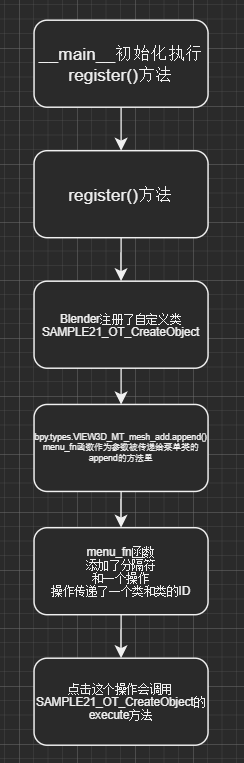

### 术语解释

* bpy  
  
bpy 全称Blender Python API，是blender使用python与系统执行数据交换和功能调用的接口模块。

* Python in Blender  Blender中的Python
Blender嵌入了一个Python解释器，它由Blender启动并保持活跃。这个解释器运行脚本以绘制用户界面，并用于一些Blender的内部工具。

* The Default Environment  默认环境
在开发自己的脚本时，它可能有助于理解Blender如何设置Python环境。

   <!-- more -->

* Script Loading  脚本加载
但重要的是要注意直接执行脚本或将脚本导入模块的区别。  
扩展Blender的脚本——定义在脚本执行之外的类，这使得将来对这些类的访问(例如取消注册)比导入模块更困难，因为在模块中保存类实例，之后可以通过导入该模块来访问这些类。  
出于这个原因，最好只使用直接执行脚本，而不是通过注册类来扩展Blender。
下面是一些在Blender中直接运行脚本的方法
    * 加载到文本编辑器中，然后 Run Script.
    * 输入或粘贴到python控制台中.
    * 在命令行中执行python文件:
        blender --python /home/me/my_script.py
作为模块运行:
    * 很明显的方法, 在文本编辑器或者Python终端中输入 import some_module .
    * 打开一个文本块并标记 “注册”选项, 这将和blend文件一起加载.
    * 复制到目录 scripts/startup中, 那么他们将在启动时自动加载.
    * 定义为插件, 启用的插件将作为Python模块使用.

* Addons  插件
一些Blender的功能最好是根据个人需要可选择的，他们保存在scripts/addons/目录中，只有在用户设置选择他们的时候才会自动启动。
插件和内置Python模块之间的唯一区别是，插件必须包含一个bl_info变量，该变量用于将名称、作者、类别和URL等元数据读取。
用户选项的插件清单使用bl_info来显示关于每个插件的信息。

* 通过类集成  
    这块还不懂，仅作记录。
在文本编辑器中运行Python脚本对于测试非常有用，但是您需要扩展Blender，使工具与其他内置功能一样可访问。
    Blender Python api允许集成:
    * bpy.types.Panel
    * bpy.types.Menu
    * bpy.types.Operator
    * bpy.types.PropertyGroup
    * bpy.types.KeyingSet
    * bpy.types.RenderEngine
    这是故意有限。目前，对于更高级的特性，如网格修改器、对象类型或着色节点，必须使用C/C++。
    对于Python 集成Blender，它定义了所有类型都通用的方法。这是通过创建一个包含由父类指定的变量和函数的一个Python子类来实现的，它被预
    先定义为与Blender的接口。
    ```py
    import bpy
    class SimpleOperator(bpy.types.Operator):
        bl_idname = "object.simple_operator"
        bl_label = "Tool Name"
        def execute(self, context):
            print("Hello World")
            return {'FINISHED'}
    bpy.utils.register_class(SimpleOperator)
    ```
    首先，我们定义了一个bpy.types的子类，这在所有可以与Blender结合使用的类中都很常见，所以我们知道如果这是一个操作符，而不是在注册一个面板。
    两个类属性都以bl_前缀开头。这是一个惯例用来区分Blender定义的变量和你自己添加的。
    接下来查看execute函数，它接受一个操作符和当前上下文的实例。常用的前缀不用于函数。
    最后，注册函数被调用，它将类并载入到Blender
    ```py
    混合类实例:
    import bpy
    class BaseOperator:
        def execute(self, context):
            print("Hello World BaseClass")
            return {'FINISHED'}
    class SimpleOperator(bpy.types.Operator, BaseOperator):
        bl_idname = "object.simple_operator"
        bl_label = "Tool Name"
    bpy.utils.register_class(SimpleOperator)
    ```
    注意，这些类没有定义__init__(self)函数。如果定义了__init__()和__del__()，那么类实例的生命周期只会跨越执行。例如，一个面板将为每次重绘提供
    一个新实例，因此很少有理由在面板实例中存储变量。相反，应该将持久变量存储在Blenders data中，以便在重新启动Blender时恢复状态。
    一旦这个类注册了Blender，就会将类实例化，并将函数调用为Blender。实际上，您不能像大多数Python API那样，从脚本中实例出这些类。
    为了调用你定义的运算，你必须通过ops API来调用：
    ```
    import bpy
    bpy.ops.object.simple_operator()
    ```
    用户接口是在一个指定的上下文中，其中可以绘制、按钮窗口、文件头、工具栏等，然后在显示该区域时绘制它们，所以它们是不会直接被Python脚本调用的。
* Registration  注册　  

    * Module Registration  模块注册  
    在启动时加载的Blender模块需要Registration()和unregister()函数。这些都是您的代码中唯一可以调用的函数，否则就是一个常规的Python模块。
    一个简单的Blender/Python 模块有这样的形式：
    ```py
    import bpy

    class SimpleOperator(bpy.types.Operator):
        """ See example above """

    def register():
        bpy.utils.register_class(SimpleOperator)

    def unregister():
        bpy.utils.unregister_class(SimpleOperator)

    if __name__ == "__main__":
        register()
    ```
    这些函数通常出现在包含类注册的脚本的底部，有时添加菜单项。您还可以在内部为您自己的工具设置数据时使用它们，但要注意，因为在加载新的blend文件时，注册器不会重新运行。
    因为有了register和unregister的调用，所以在Blender运行时可以切换插件和重载脚本。如果注册调用被放置在脚本的主体中，导入时就会调用注册，这意味着导
    入模块或将其加载到Blender中是没有区别的。
    最后两行仅仅是为了测试：
    ```py
    if __name__ == "__main__":
        register()
    ```
    这允许在文本编辑器中直接运行脚本以测试更改。由于__main__是为直接执行保留的，所以这个register()导入时不会直接运行。

    * Class Registration  类注册  
    用Blender注册一个类，将类定义加载到Blender中，并与现有功能一起使用。
    加载此类后，您可以从bpy.type访问它。类型，使用bl_idname而不是类原来的名称。
    当加载一个类时，Blender对确保所有必需的属性和函数进行了完整性检查，这些属性具有正确的类型，并且函数的参数数量正确。
    大多数情况下，你不需要关心这个问题，但是如果这个类定义有问题的话，它会在注册时提出:　　　
    使用函数参数时 def execute(self, context, spam), 会报错:
    ValueError: expected Operator, SimpleOperator class "execute" function to have 2 args, found 3
    使用类型 bl_idname = 1 将会提示.
    TypeError: validating class error: Operator.bl_idname expected a string type, not int


### vscode下的blender环境设置

- 安装python3.0以上(Blender 2.8是 python3.x)

- Vscode 安装python 和 blender Development 插件

- 终端安装 fake-bpy 包``pip install fake-bpy-module-2.80``

   https://github.com/nutti/fake-bpy-module

  安装完上面这些，vscode里面就会有自动补全

如何Debug：

- ctrl + shift + P, 选择 "Blender: Start"

- 选择你的blender安装路径, vscode会连接到blender

- ctrl + shift + P, "Blender: Run script" 并且可以使用断点调试

### 基础知识
#### 重要信息
* 所有对象的都存在上下文，以及各种模式及其对应的操作。  
* 在任何情况下，只有一个物体处于活动状态，并且可以有多个选定对象。  
* 所有物体都是blend文件中的数据。  
* 存在创建和修改这些对象的操作/函数。  

#### 模板

```py
import bpy   #提供给附加开发人员的API


# bl_info变量，其中包含有关附加组件的信息
bl_info = {
    "name": "sample",
    "author": "syx",
    "version": (1, 0),
    "blender": (2, 83, 0),
    "location": "3D视口>添加>网格",
    "description": "创建对象的示例附加组件",
    "warning": "",
    "support": "TESTING",
    "wiki_url": "文档位置",
    "tracker_url": "报告问题",
    "category": "Object"
}


# 创建对象的运算类（ICO球）
class SAMPLE21_OT_CreateObject(bpy.types.Operator):#注意这里的继承，继承至Operator

    bl_idname = "object.sample21_create_object"# Blender内部使用的ID
    bl_label = "球" # 菜单项目中显示的字符串
    bl_description = "添加ICO Sphere" # 菜单项上显示的说明
    bl_options = {'REGISTER', 'UNDO'} # 处理属性

    # execute 在该方法中，定义执行菜单时的处理。
    # 调用该方法时，将从Blender本身传递以下参数
    # self	operate class	operate class的实例
    # context	bpy.types.Context	execute 方法执行上下文
    def execute(self, context):
        bpy.ops.mesh.primitive_ico_sphere_add(radius=2.0, location=(5.0, -5.0, 0.0), rotation=(0.79, 0.0, 1.57))
        print("添加ICO球体。")

        return {'FINISHED'}


# 构建菜单的功能
def menu_fn(self, context):
    self.layout.separator()
    self.layout.operator(SAMPLE21_OT_CreateObject.bl_idname)

# 要在Blender中注册的类
classes = [
    SAMPLE21_OT_CreateObject,
]

# 加载项激活时的函数
def register():
    for c in classes:
        bpy.utils.register_class(c)
    bpy.types.VIEW3D_MT_mesh_add.append(menu_fn) # 这里给菜单添加了功能
    print("Sample已激活")


# 禁用附加组件时的处理
def unregister():
    bpy.types.VIEW3D_MT_mesh_add.remove(menu_fn)# 这里移除了菜单里添加的功能
    for c in classes:
        bpy.utils.unregister_class(c)
    print("Sample已被禁用")


# 初始化
if __name__ == "__main__":
    register()# 仅执行附加注册处理

```


#### 插件路径

- 目录：user\AppData\Roaming\Blender Foundation\Blender\scripts\addons,代表非系统原生的用户插件,blender所有安装的外部插件都会被解压放置到这个文件夹下。

  安装插件可以在blender的addon界面直接选择zip文件安装，也可以把插件文件夹直接拖入此目录。

- 目录：D:\blender-2.81a\2.81\scripts\addons

  第二个是软件原生插件路径，不建议将自己写的插件放入此地，此地不少系统插件的代码可在以后做参考用，值得了解。


#### 如何查看命令 

- 类似maya 直接执行某个功能，看info输出命令（A+X清空info）
- 选中命令直接 Copy Data Path.
- 鼠标悬停在某个命令上看提示，如果没有提示，要去perfence里面的interface下勾选Python Tooltips.
- 控制台直接输入``dir（某个模块名）``查看输出
- 打开blender的text editor，很多模板文件可供使用：
- 用python console中的.后代码提示快捷键自动补全查看方法（ctrl+space）
- 查询api
- 全球最大爱好者论坛https://blender.stackexchange.com/
- 查看各类开源插件

#### 常用命令

``bpy.context.`` 正文，当前环境的所有内容的意思

``bpy.context.object`` 物体

``mesh = bpy.data.objects["mesh"]`` Mesh变量存储物体mesh

``bpy.ops.object.select_all(action='SELECT')``全选命令

``bpy.ops.object.select_all(action='DESELECT')``全不选命令

``bpy.context.view_layer.objects.active = mesh``大纲选中，激活物体

``bpy.context.object.location`` 拿到选中物体的世界坐标

``bpy.context.object.location.z``拿到选中物体的世界坐标中的Z坐标数值

``bpy.context.object.location.z += random()`` 选中物体的世界坐标中的Z坐标数值随机加一个数

``bpy.context.object.name``查看选中物体的名字

``bpy.ops.object.duplicate(linked=False,mode='TRANSLATION')``复制模型

``bpy.ops.object.modifier_add(type='DECIMATE')``添加编辑器

``bpy.context.object.modifiers["Decimate"].ratio = 0.1``设置编辑器参数

``bpy.ops.object.modifier_apply(apply_as='DATA', modifier="Decimate")``#应用编辑器

``bpy.context.object.name = "要改的名字"`` 选中物体的名字

``bpy.ops.mesh.primitive_cube_add()``创建box

``bpy.context.object.active_material``返回当前选择物体的材质球

``bpy.data.materials.get(材质球名称字符串)``拿到当前场景的某个材质

``bpy.context.view_layer.objects.active.material_slots.data.active_material= 某个材质`` 给当前激活的物体材质球插槽赋予某个材质

``bpy.ops.wm.save_mainfile(filepath="E:\\Test\\testsave.blend") ``存储当前文件

``bpy.ops.wm.open_mainfile(filepath=BlendFilePath)`` 打开文件

得到当前版本的blender文件夹路径

```
import sys
argv = sys.argv #当前blender的路径例：['D:\\blender-2.81a\\blender.exe']
```

遍历列表选中物体：

```
for i in bpy.context.visible_objects:#迭代所有可见物体
	if i.name == "要选物体的名字":
		i.select_set(state=True)
for i in bpy.context.visible_objects:
    if i.type == "MESH":#判断物体类型是模型
        bpy.context.view_layer.objects.active = i #当前激活物体定义为i
        bpy.ops.object.mode_set(mode='EDIT') #编辑模式
        bpy.context.tool_settings.mesh_select_mode = (False, True, False)#编辑模式的（点线面）
        bpy.ops.mesh.select_all(action='SELECT')#全选命令
        bpy.ops.object.mode_set(mode='OBJECT')#关闭编辑模式
```


### 常用模块

##### bpy.app
有关Blender本身的信息，在运行时不会更改。


##### bpy.context
Blender中当前活动内容的只读列表  
例如：  

```py
bpy.context.mode # 将打印当前3D视图所处于的模式 （物体、 编辑、 雕刻等）
bpy.context.active_object#获得对3D视图中当前活动对象的访问
bpy.context.selected_objects#获得对3D视图中当前选择对象

bpy.context.active_object.location.x = 1# 将激活物体的X位置数值更改为1
bpy.context.active_object.location.x += 1# 将激活物体的X位置数值+1

bpy.context.active_object.location = (1, 2, 3)# 修改XYZ
bpy.context.active_object.location.xy = (1, 2)# 修改XY
type(bpy.context.active_object.location) #物体位置的数据类型
dir(bpy.context.active_object.location)#物体位置可以提供的其它功能

[obj for obj in bpy.context.selected_objects if obj != bpy.context.object]# 打印一个不包含当前活动对象的对象列表


bpy.context.scene.collection.all_objects# 拿到所有object

```


##### bpy.data
Blender的所有内部数据，例如对象。

有访问.blend文件中所有数据的函数和属性。

你可以访问当前.blend文件中的以下数据: 对象、网格、材质、纹理、场景、窗口、 声音、 脚本等。
```py
bpy.data.objects
# 打印当前blender 的所有对象的名字和它的位置
for object in bpy.data.objects:
    print(f"{object.name} is ata location {object.location}")

bpy.data.collections["collistion_name"]#  拿到collection  类
bpy.data.collections["collistion_name"].objects # 拿到collection类下所有objects 

# 遍历collection 下所有物体 
coll = bpy.data.collections["collistion_name"]
for ob in coll.objects:
    print(f"ob name is {ob.name}")
```


##### bpy.msgbus
代表“消息总线”，用于通知Blender某些更改。

##### bpy.ops
您可以在Blender中执行的所有操作，从建模到将文件附加到渲染。
该工具系统是围绕操作的概念构建的。操作常从按钮或菜单执行，但也可以直接从Python调用。


##### bpy.path
处理文件路径的函数。 

##### bpy.props
Blender使用的不同属性。您可以使用它来告诉Blender输入应该是数字还是颜色。 

##### bpy.types
Blender中存在的每种事物类型，从修改器到纹理再到灯等等。


##### bpy.utils
实用程序功能，仅适用于Blender，但不处理内部数据。


### 引用
https://www.cnblogs.com/wildbloom/
https://www.bookstack.cn/read/blender-2.80-zh/a1560e684723ed9a.md
