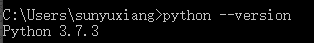
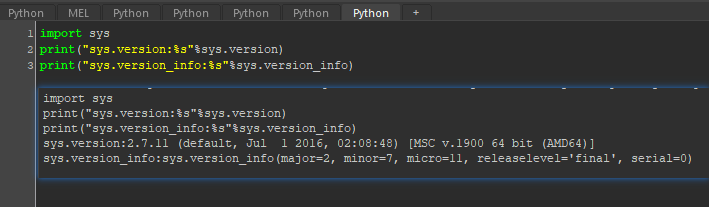
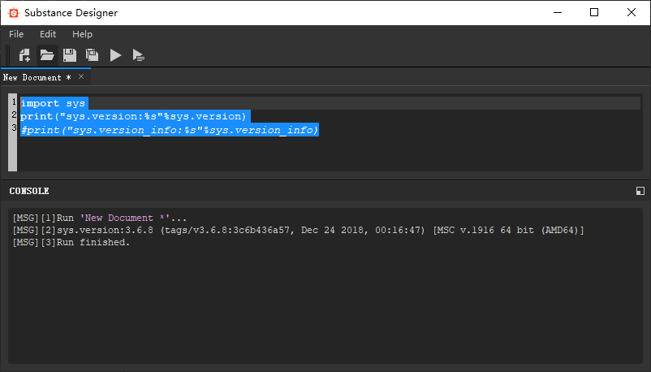
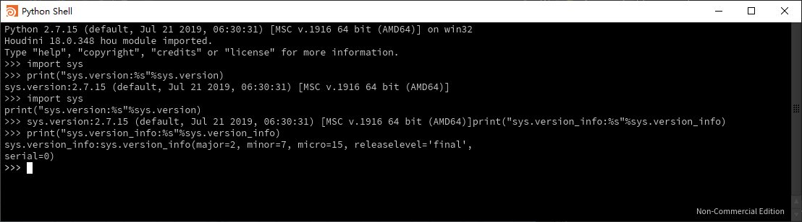
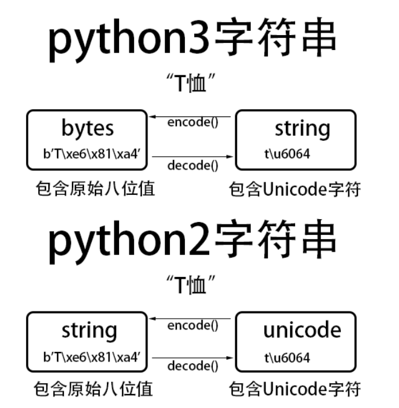
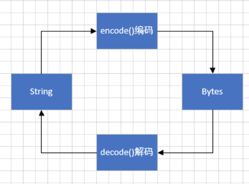

编写高质量代码的59+91个建议读书笔记

### 第一条
* 确认自己所用的python版本。
* 确保该版本与你想使用的python版本相符。
* 优先使用python3

##### Windows平台下：
`$python --version`


<!-- more -->

##### 其他程序内：
* Autodesk Maya:


* Substance Designer:

注：SD里sys.version_info报错，原因未知

* Houdini：


Tips： Python中sys模块还有一个常用功能：
`sys.path`可以用来找到应用程序内的python编译器位置.

### 第二条
遵循PEP8 风格指南
《Python Enhancement Proposal #8》（8号Python增强法案）又叫PEP8,它是针对Python代码格式而编订的风格指南。
* 使用空格来表示缩进，而不要用制表符（tab）。
* 和语法相关的每一层缩进都用四个空格表示。
* 每行的字符数不应超过79。
* 对于占据多行的长表达式，除了首行之外的其余各行都应该在通常的缩进级别之上再加四个空格。
* 文件中的代码与函数和类之间应该用两个空行隔开。
* 在同一个类中，各方法之间应该用一个空行隔开。
* 在使用下标来获取列表元素、调用函数或给关键字参数赋值的时候，不要再两边添加空格。
* 为变量赋值的时候，赋值符号的左侧和右侧应该各自写上一个空格，而且只写一个。

命名：PEP8 提倡采用不同的命名风格来编写Python代码中的各个部分,以便再阅读代码时可以根据这些名称看出它们的角色。
* 函数、变量名及属性应该用小写字母，各单词之间用下划线相连，例如，lowercase_underscore。
* 受保护的实例属性，应该以单个下划线开头，例如，_leading_underscore.
* 私有的实例属性，应该以两个下划线开头，例如__double_leading_underscore.
* 类与异常， 应该以每个单词首字母均大写的形式来命名，例如，CapitalizedWord。
* 模块级别的常量，应该全部采用大写字母来拼写，各单词之间以下划线连接，例如，ALL_CAPS。
* 类中的实例方法（instance method），应该把首个参数命名self，以表示该对象自身.
* 类方法（class method）的首个参数，应该命名cls，以表示该类自身。

表达式和语句《The Zen of Python》（python之禅）中说，每件事都应该有直白的做法，而且最好只有一种。
* 采用内联形式的否定词 ，而不要把否定词放在整个表达式的前面，例如，应该写 if a is not b 而不是 if not a is b。
* 不要通过检测长度的方法来判断列表是否为空，而是应该采用if not somelist来判定。
* 同上条，如果判断列表不为空也是一样的， 
* 不要编写单行的if语句、for循环、while循环及except复合语句，而是应该把这些语句分成多行来书写，以示清晰。
* import语句应该重视放在文件开头.
* 引入模块的时候，总是应该使用绝对名称，而不应该根据当前模块的路径来使用相对名称，例如，引入bar包中的foo模块时，应该完成的写出 from bar import foo，而不应该简写为import foo。
* 如果一定要以相对的名称来编写import语句，那就采用明确的写法:from.import foo。
* 文件中的那些import语句应该按照顺序划分为三个部分，分别为标准库模块、第三方模块以及自用模块。各import语句应该按照模块的字母顺序来排列。

Tips： vscode可以采用pylint来自动检测受测代码是否符合pep8。
https://www.pylint.org/

### 第三条
##### 了解bytes、str、和unicode的区别
* python3有两种表示字符序列的类型，bytes和str，前者的实例中包含原始的8位值，后者的实例中包含Unicode字符。
* python2中也有两种表示字符序列的类型，str和Unicode. 前者包含原始的八位值，后者的实例着包含unicode字符。

* bytes 类型，是指一堆字节的集合，十六进制表现形式，两个十六进制数构成一个 byte ，以 b 开头的字符串是 bytes 类型。计算机只能存储二进制，字符、图片、视频、音乐等想存到硬盘上，必须以正确的方式编码成二进制后再存，但是转成二进制后不是直接以 0101010 的形式表示的，而是用bytes() 的类型来表示的。
* 把Unicode字符表示为二进制数据（原始八位值）有很多办法，常见且推荐的编码方式就是UTF-8。
* 但是python3 的str实例和python2的Unicode实例都没有和特定的二进制编码形式相关联，想要把Unicode字符转换为二进制数据，就必须使用encode方法，想要把二进制数据转化成为Unicode字符，则必须使用decode 方法。

* 在 Python3 中内存里的字符串是以 Unicode 编码的，Unicode 的其中一个特性就是跟所有语言编码都有映射关系，所以 UTF-8 格式的文件，在 Windows 电脑上若是不能看，就可以把 UTF-8 先解码成 Unicode ，再由 Unicode 编码成 GBK 就可以了。

##### 字符串的转换
* 在Python3中，接受str或byts，并总是返回str的方法:
    ```py
    def to_str(bytes_or_str):
        if isinstance(bytes_or_str, bytes):#注意这个函数
            value = bytes_or_str.decode('utf-8')
        else:
            value = bytes_or_str
        return value
    ```
* 接受str或bytes，并总是返回bytes的方法：
    ```py
    def to_bytes(bytes_or_str):
        if isinstance(bytes_or_str, str):
            value = bytes_or_str.encode('utf-8')
        else:
            value = bytes_or_str
        return value
    ```
* 在Python2中，接受str或unicode，并总是返回unicode的方法：
    ```
    def to_unicode(unicode_or_str):
        if isinstance(unicode_or_str, str):
            value = unicode_or_str.decode('utf-8')
        else:
            value = unicode_or_str
        return value
    ```
* 接受str或unicode，并总是返回str的方法：
    ```
    def to_str(unicode_or_str):
        if isinstance(unicode_or_str, unicode):
            value = unicode_or_str.encode('utf-8')
        else:
            value = unicode_or_str
        return value
    ```
##### 推荐的文件操作符
如果通过open函数获取文件句柄，该句柄会采用UTF-8编码格式来操作文件。
而在Python2中，文件操作的默认编码格式则是二进制形式。这可能会导致程序出现奇怪的错误。
例如，向文件中随机写入一些二进制数据。下面这种方法Python2中可以正常运行，但是在Python3中则不行：
```py
with open('/tmp/random.bin', 'w') as f:
    f.write(os.urandom(10))
>>> TypeError: must be str, not bytes
```
上述情况是因为Python3给open函数添加了名为encoding的新参数，而这个新参数默认值是’utf-8′。这样在文件句柄上进行read和write操作时，系统就要求开发者必须传入包含unicode字符的str实例，而不接受包含二进制数据的bytes实例。

解决这个问题，可以用二进制写入模式(‘wb’)来开启待操作的文件，按照这种方式可同时适配Python2和Python3：

```py
with open('/tmp/random.bin', 'wb') as f:
    f.write(os.urandom(10))
```
(读取文件也同理，可使用’rb’模式)

### 第四条
用辅助函数来取代复杂的表达式
* 开发者很容易过度运用Python的语法特性，从而写出那种特别复杂并且难以理解的单行表达式。
* 请把复杂的表达式移入辅助函数中。如果要反复使用相同的逻辑，那就更应该那么做。
* 使用if/esle表达式，要比用or或者and 这样的Boolean操作符写出的表达式更清晰。

### 第五条
了解切割序列的方法
python提供了一种把序列切成小块的写法，这种切片操作很容易四开发者轻易的访问序列中的某些元素所构成的子集。  
最简单的用法，就是对内置list和bytes进行切割。  
切割操作还可以延伸到实现了__getitem__和__setitem__这两个特殊方法的python类上，参见28条。
* 不要写多余的代码。但start索引为零或者end索引为序列长度时，应该将其忽略
* 切片操作不会计较start或者end索引是否越界，这样我们很容易从前端或者后端开始。
* 对list赋值时，如果使用切片操作，就会把原列表中处在相关范围内的值替换成新值，即便它们的长度不同也依然可以替换。

### 第六条
在单词切片操作内，不要同时指定start、 end 和 stride 
* 问题在于采用stride方式进行切片时，经常会出现不符合预期的结果
* 切割列表时，如果制定了stride，代码就会变得费解。尤其是stride为负值的时候更是如此.
* 在同一个切片操作内，不要同时使用start、end和stride. 如果确实需要执行这种操作，那就考虑将其拆解为两条赋值语句，其中一条做范围切割，另一条做步进，或者考虑使用内置itertools模块中的islice.

tips：
`mystring[::-1]#反转字符串`

### 第七条
用列表推导来取代map和filter
python提供了一种精炼的写法，可以根据一个列表来制作另外一个列表.这种表达式称为list comprehension （列表推导）
* 列表推导要比内置的map和filter函数清晰
* 列表推导可以很跳过输入列表中的某些元素
* 字典与集也支持推导表达式

### 第八条
不要使用含有两个以上表达式的列表推导
* 列表推导支持多级循环，每一级循环也支持多项条件
* 超过两个表达式的列表推导难以理解，应该尽量避免
Tips：
```py
matrix = [[1,2,3],[4,5,6],[7,8,9]]
flat = [x for row in matrix for x in row]
print(flat)
>>>[1,2,3,4,5,6,7,8,9]
```

```py
a = [1,2,3,4,5,6,7,8,9,10]
#下面两种写法是等效的
#要从列表中取出大于4的偶数
b = [x for x in a if x>4 if x %2 ==0]
c = [x for x in a if x>4 and x%2==0]
```

### 第九条
用生成器表达式来改写数据量较大的列表推导
列表推导的缺点是，对于输入序列中的每个值来说，都要创建一项仅含一项元素的全新列表，但输入数据较大时，可能会消耗大量内存，并导致程序崩溃。
为了解决此问题，python 提供了生成式表达式
```py
it = (len(x) for x in open(temp.txt))
print(it)
>>>
<generator object <genexpr> at 0x101b81480>
print(next(it))
print(next(it))
>>>
100
57
```

Tips：
获取文件每行的字符数

```py
value = [len(x) for x in open(temp.txt)]
print(value)
```

* 当输入的数据量较大时，列表推导可能会因为占用太对内存而出问题。
* 由生成表达式所返回的迭代器，可以逐次产生输出值，从而避免了内存用量问题。
* 把某个生成器表达式说返回的迭代器，放在另一个生成器表达式的for子表达式中，即可将二者组合起来。
* 串在一起的生成器表达式执行速度很快。 

### 第十条
尽量用enumerate取代range
在一些列的整数上面迭代，内置的range函数很有用，
当迭代列表的时候，通常还想知道当前元素在列表中的索引。
```py
for i in range(len(flavor_list)):
    flavor = flavor_lsit[i]
    print("%d:%s"%(i+1,flavor))
```
这种代码不利于理解，python提供了enumerate来解决此问题。enumerate可以把各种迭代器包装为生成器，以便稍后产生输出值，生成器每次产生一对输出值，前者为循环下标，后者表示从迭代器中获取到的下一个序列元素，这样写出来的代码会非常整洁。
```py
for i ,flavor in enumerate(flavor_list):
    print("%d:%s"%(i+1,flavor))
```

* enumerate函数提供了一种精简的写法，可以在遍历迭代器时获知每个元素的索引
* 尽量用enumerate来改写那种将range与下标访问相结合的序列遍历代码
* 可以给enumerate 提供第二个参数，已指定开始计数时所用的值（默认为0）


Tips:
还可以直接指定enumerate开始计数所用的值。
```py
for i ,flavor in enumerate(flavor_list，1):
    print("%d:%s"%(i,flavor))
```

### 第十一条
用zip函数同时遍历两个迭代器

* 使用for循环
```py
names = ['Cecilia', 'Kufu', 'JayChou']
letters = [len(n) for n in names]
longest_name = None
max_letters = 0

for name, count in zip(names, letters):
    if count > max_letters:
        longest_name = name
        max_letters = count
>>>
Cecilia
```
上面这段代码问题在一，整个循环语句看上去很乱，用下标来访问names和letters会使代码不易阅读。
改用enumerate可以稍稍缓解这个问题，但仍然不够理想。

* 使用for循环加enumerate
```py
names = ['Cecilia', 'Kufu', 'JayChou']
letters = [len(n) for n in names]
longest_name = None
max_letters = 0

for i, name in enumerate(names)：
    count =letters[i]
    if count > max_letters:
        longest_name = name
        max_letters = count
```
* 使用zip
```py
names = ['Cecilia', 'Kufu', 'JayChou']
letters = [len(n) for n in names]
longest_name = None
max_letters = 0

for name, count in zip(names, letter):
    if count > max_letters:
        longest_name = name
        max_letters = count
```

* 内置的zip函数可以平行的遍历多个迭代器
* Python3中的zip相当于生成器，会在遍历过程中逐次产生元组，而Python2中的zip则是直接把这些元组完全生成号，并一次性的返回给整份列表。
* 如果提供的迭代器长度不等，那么zip就会自动提前终止。
* itertools 内置模块中的zip_longest函数可以平行的遍历多个迭代器，而不用在乎它们的长度是否相等。


### 第十二条
不要在for和while循环后面写else语块

* python 有种特殊语法，可在 for及 while 循环的内部语句块之后紧跟一个else块。
* 只有当整个循环主体都没遇到break语句时，循环后面的else块才会执行。
* 不要再循环后面使用else块，因为在这种写法即不直观，又容易引人误解。
### 第十三条
合理利用try/except/else/finally 结构中的每个代码块
异常处理可能要考虑四种不同的时机，
1.finally块
如果既要向上传播，又要在异常发生时执行清理工作，那就可以使用try/finally结构 
```py
handle = open("/tmp/data.txt")   #May raise IOError
try:
    data = handle.read()         #May raise unicodeDecodeError
finally:
    handle.close()               #Always runs after try:
```
read方法抛出异常会向上传播给调用方，而finally块中的handle.close方法则一定能够执行。open方法放到try块外面是因为如果打开文件发生异常，那么程序应该跳过finally块。
2. else块
try/except/else结构可以清晰的描述出哪写异常会由自己的代码来处理，哪写异常会传播到上一级。如果try没有发生异常，那么就执行else块。
```py
def load_json(data,key):
    try:
        result_dict = json.loads(data) #May raise ValueError
    except ValueError as e:
        raise KeyError from e
    else:
        return result_dict[key]        #May raise KeyError
```
如果数据不是有效的json格式，那么会产生ValueError，这个异常会由except块来捕获处理并处理，如果能够执行，就会执行else里面的查找语句，如何查找执行有异常，那么该异常就会向上传播，因为查询语句并不在try范围内，这种else子句会把try/except后面的内容和except块本身区分开，使异常的传播行为变得更加清晰。

3. 混合使用
要从文件中读取某项事务的描述信息，处理该事务，然后就地更新该文件。
```py
UNDEFINED = object()
def divide_json(path):
    handle = open(path,"r+")
    try:
        data = handle.read()
        op = json.loads(data)
        value = (op["numrator"]/op["denominator])
    except ZeroDivisionError as e:
        return UNDEFINED
    else:
        op["result"] = value
        result = json.dumps(op)
        handle.seek(0)
        handle.write(result)
        return value
    finally:
        handle.close()
```
使用try快读取文件并处理内容，用except块来对应try块中可能发生的异常，用else块实时更新文件，并把更新中可能出现的异常回报给上级代码，然后用finally块来清理文件句柄。
即使else块写入发生异常，finally也能关闭句柄。
Tips:
1. 无论try块是否发生异常，都可以利用try/finally复合语句块来执行清理工作。
2. else块可以用来缩减try块中的代码量，并把没发生异常时所要执行的语句与try/except代码块
3. 顺利运行try之后，若想时某些操作能在finally块清理代码之前执行，则可以将这些操作写到else块中（这种写法必须由except块）。


### 引用
https://www.cnblogs.com/lipandeng/p/11162039.html
https://lingyunfx.com/?page_id=152