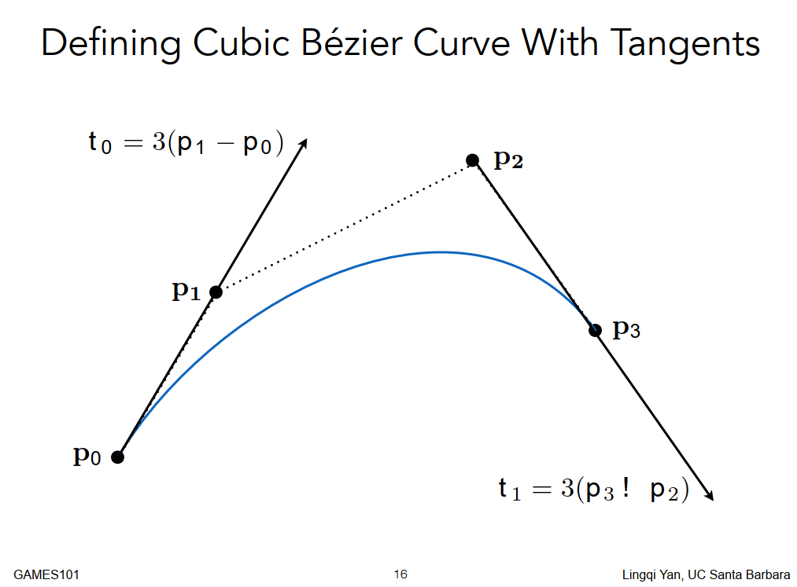
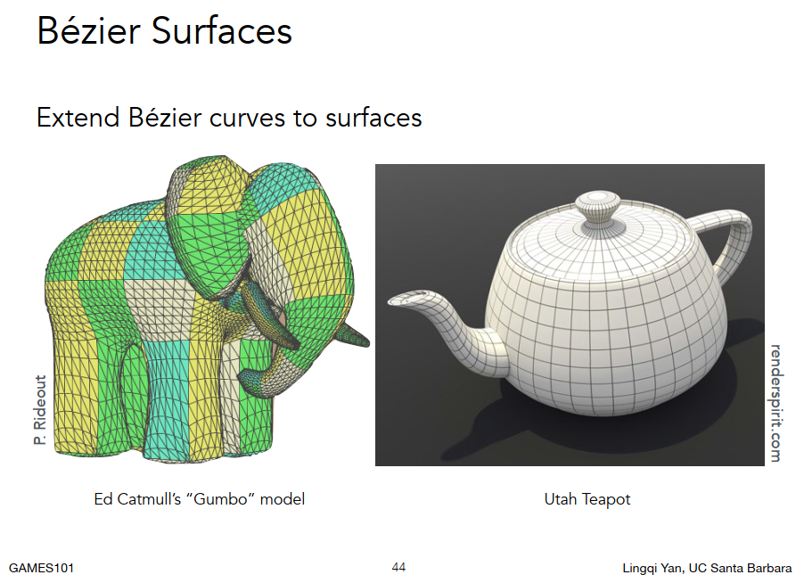

## 第十节
##### 上节课复习

1. 花了两节课学了着色，学了特定的Blinn-Phong着色模型
2. 在什么地方做着色，计算机的硬件如何做着色
3. 关于纹理映射的问题，用纹理定义逐点的属性
4. 怎么样做插值，在三个顶点定义属性，然后在三角形内部任意点怎么做，用重心坐标。
5. 纹理贴在表面上，纹理过小怎么办，做插值，纹理过大怎么办，mipmap范围查询。

给一个mesh，可以做flat shading，也可以phong shading ，也可以贴图，然后叠加各种不同的图。
今天学习反射，反射的东西是什么？拿什么东西去表述它。

##### 纹理的应用（环境光照）

纹理：本质是一张图，纹理本身可以做各种操作，比如mipmap，因为应用广泛，所以现在硬件都是可以支持的。  
所以在现在的GPU里面，可以把纹理理解为一块内存，以及可以在块内存上可以实现点/范围查询和滤波。  
纹理理解为一块数据，可以做不同类型查询。
从这个角度上出发，纹理可以表述的东西太多了。

###### 环境贴图
纹理可以用来表诉环境光，又叫环境光照，环境光映射。

不区分直接光还是反射光，总之是四面八方有光进入。在这个空间内渲染茶壶，它会被四面八方的光所照亮，也就意味着它会反射任何方向来的光。
我们可以利用纹理去描述整个环境光长什么样，用这个环境光渲染其它物体，要比点光源要好很多，怎么算之后再说。
经典模型: 犹他茶壶，斯坦福的龙和斯坦福的兔子，connel box（康奈尔的盒子）。
用纹理去描述环境光的时候，有一个假设是环境光会来自无限远处，只记录一个不同方向即可（其实不能只记录方向，应该是方向和位置）

环境光是怎么来了，我们在屋子里面放一个金属球，这个金属球整个反射出来的就是环境光。
可以利用这个特性把环境光存储到一个球上，然后就像展开地球仪一样展开这个球。
* Sphere Map

这里地面和顶上会有扭曲问题。就像地图一样，描述地球纬度高的地方会变小，纬度低的地方会变大，描述整个球上的位置是做到了，但是不是一个均匀的描述。怎么解决这个问题呢？
* Cube Map

还是用一个球，但是认为这个球有一个包围盒BoundingBox，假设从球心经过球面连一条线，这条线打到立方体的表面。然后把条线经过球面的值赋予给包围盒，也就是从球心做球面投影到立方体面上，这样就得到了六张贴图。

这个做法的缺点是，原本你想看来自某方向光线的值，可以很容易查询，现在还需判断一下在哪个面上。

Sphere Map 和 CubeMap，方式不同但是本质是一样的，都是为了描述不同方向的光照信息
**强调：光照信息，不一定只是直接光照，比如太阳光，你看到的任何物体，你能看到它，一定是因为有光线从它到达了你的眼睛，它们反射过来的光同样也是光照信息。**
###### 凹凸贴图/法线贴图
任何一个点上都给一个假的法线（通过用纹理映射的方式定义一个虚拟的高度，算出假法线）去模拟物体表面因为凹凸产生的光影效果。

利用纹理描述物体的表面任意一个点的高度是什么，基础的平面沿着法线方向前进后退各多少。
在不把几何形体变复杂的情况下，应用一个复杂的纹理从而定义任何一个点相对的高度。
相对的高度一变，法线就会发生变化，法线发生变换，着色的结果就会发生变化，就会认为这里有凹凸。凹凸贴图和法线贴图实际上就是为了法线，但是实际上并没有改变几何。

纹理是怎么扰动法线的呢？黑色线是本身模型，黄色线应用了凹凸贴图的模型，点P经过应用凹凸贴图移动了之后，它的法线就被改变了，如何计算改变过后的法线值呢？

先考虑二维情况（flatland case对应3d case）下，假设任何一个点，点P，原本是平面，法线向上就是(0,1)，蓝色线表示应用了凹凸贴图。
那么在任何一点点处，如何计算它的法线呢？
1. 首先求出这个点的梯度（导数），既这个点向右移动一个单位距离，向上会移动多少距离。也就是这个曲线上任何一点的切线如何计算。
2. 用这个点和这个点向右移动单位距离的高度差除以间隔（1），在引入某一个常数，定义凹凸贴图的影响强度。  
3. 法线就是垂直于切线的一个量。  

实际情况下,二维贴图和(0.0.1)的法线情况下，依旧是先求出来梯度，先假设这个点是（u，v），利用向u和向v移动一个单位算出来切线后，在利用叉乘求出法线，然后在归一化变成单位向量即可。  
思路：在局部都可以定义一个局部坐标系，就认为局部的法线是(0.0.1)，并且又有两个垂直的分量S、T，也就是说S、T、N组成了一个坐标系，在这个坐标系里面认为法线永远是（0，0，1），把算出来的法线方向在重新计算回世界坐标里面。

法线贴图和凹凸的贴图的区别是，凹凸贴图只是定义某一个点前进或者后退多少，还需要再计算得出新生成的法线是多少，但是法线贴图一点的像素（rgb）直接就是该点产生的新normal的值，不需要额外计算。

导数：

就像物理上的可以求平均速度，也可以求出函数的平均速度，也就是函数平均变化率。  
  
函数的平均变化率，其实就是红线，当X0和X1重叠的时候，这段区间就变成了一个点。这条线就变成这个点的切线。  

这时候我们把这个比值称为导数。  
如何求导：  
  
[视频教程](https://www.bilibili.com/video/BV1vb411a78y?p=3)  

###### 位移贴图

首先凹凸一模一样，都是用纹理定义任何一点的高度，只不过位移贴图会把顶点真的做一个位置的移动，而不是模拟移动来计算法线。  
这样做的代价是要求模型面数足够，足够到模型的三角形顶点距离小于纹理距离。
但是这样太费了，能不能开始先用一个低面数模型，应用位移贴图的过程中，提前检测需不需提高面数，如果需要就把三角形拆成很多小三角形，DX里面提供了一个动态的曲面细分，就是这个意思，

###### 三维纹理

定义一个三维空间中的噪声值，有一个解析式，可以在空间中任何一点算出对应的噪声值，这样一来就等于三维空间有一个噪声，这个噪声经过一系列的处理就可以变成纹理。
Perlin noise 得到广泛应用。
具体以后再说。
###### 纹理记录

纹理记录一些以前计算好的数据。
把提前算好的环境光遮蔽存储到贴图上，然后把着色的结果乘以计算好的环境光遮蔽的纹理就可以快速得到结果。
环境光遮蔽怎么算以后再说。
###### 三维纹理和体积渲染

之前学的光照模型都是计算一个表面，在其他领域比如医学里面，需要一个体积的渲染。
三维的像素怎么算以后再说。

##### geometry 几何
###### Examples of geometry 几何的例子
比如玻璃杯和汽车玻璃，世界上是真实存在一些光滑曲面，不管离多近都看不到离散的想象（三角形），在图形学里面是如何描述这些几何形体的呢？
还有几何如何表述 ，发动机内部，布料，液体，城市，毛发，微观，树木，这些复杂的问题呢？

简单的分类：
1. Implicit 隐式的几何

不会告诉你点在哪里，但是会告诉你这些点满足的关系。
例如一个隐式单位球：

给定任何一个(x,y,z)都可以判断它是否在定义的球的表面上。
一个显式的球就是用三角形把这个球给拆出来，然后把不同的三角形给表述出来。
隐式的几何就是表示一定的关系，而不给你实际的点。

对于一个隐含的表述，很难知道它是什么。好处是很容易判断一个点在不在这个面上，

0在表面，负在内，正在外。

2. Explicit 显式的几何

一种是点直接表述出来：一个三角形面就是一个典型的显式几何。第二种是通过参数映射定义的表面例如给你(u,v) 输出的是（x,y,z）,把所有的uv都走一遍就可以获得对应的（x,y,z），例如贝塞尔曲线。  

（x,y,z）都是知道，所以叫显式
它是显式的表示，但是通过式子是什么不知道。

判断一个点在里面在外面变难了。

总结：目前为止，没有有一种办法可以解决几何的所有问题，因为这些特性，不同的物体适合用不同的显示方式。

###### 更多隐式的几何表达方式

1. 代数表面
2. 构造实体几何（距离场）
3. 等高线
4. 分形

数学公式表述有一个严重的问题，不直观。

CSG  
  
距离函数，对于任何一个几何，都不直接描述它的表面，而是描述任何一个点到这个表面上任何一个点的最小距离，这个距离可以是负的也可以是正的。如果认为有一个点在这个物体表面以外，就可以算出来一个正数，如果认为有一个点在这个物体内部，就可以算出来一个负数，如果把两个物体的两个距离函数都算出来之后，然后就可以把两个距离函数做一个融合，然后再把它恢复成原来的样子，就可以得到一个变换。  
  
应用距离函数：  
对于A和B，靠近距离函数接近0，远离距离函数也就远离0，把A和B的两张图融合就可以得到第三张图.  
  
距离函数非常厉害，可以表示各种不同的东西。  
  
等高线  

分型，图形学上的递归。  
中间的西兰花在渲染的时候会引起强烈的走样，因为变化频率实在太高。  

总结：

Implicit 隐式的几何
优点：
1. 表述起来非常容易（公示），存储容易。
2. 方便查询在里面在外面（判断对应的函数小于零大于零）
3. 方便计算光线的求交
4. 简单的形状表达起来非常精确
5. 容易控制它的拓扑结果
缺点：
1. 很难描述复杂的形状

###### 更多显式的几何表达方式

1. 三角面
2. 贝塞尔表面
3. 细分曲面
4. Nurbs
5. 点云

  
点云  
点多表示效果良好，点少表示效果差  
点云需要大量的点，理论上可以表示任何结构。  
点云转换成三角形有很多研究在做。  
  
最广泛的使用，多边形模型  
通过存储点来组成多边形（三角形或者四边形）  
轻松的去处理/模拟，适合采样  
更复杂的数据结构  
也许是图形中最常见的表示形式  
  
常见的obj格式的写法  
v：point   
vt：vertex  
vn：vertex normal  
f：三角面   
f: v/vt/vn  v/vt/vn  v/vt/vn  

##### Curves 曲线  
曲线的应用广泛：  
1： 路径动画  
2： 字体设置  
  
  
###### Bezier Curves 贝塞尔曲线  
  
定义 P0 P1 P2 P3 形成一条曲线  

如何去计算一条贝塞尔曲线呢？  
  
以三次贝塞尔曲线为例  
  
在0-1的时间t，找到他在0-1时间的位置。  
  
先在b0到b1中间找t的位置  
再在b1到b2中间找t的位置  
  
最后连起来b01和b11，形成一条线，找t的位置，即使在时间t的时候，这个点位置。  
  
只要能画一个点，就能找到所有其他点，递归画出来即可。   
  
直观的动画解释：  

贝塞尔曲线的属性：  
  
其中凸包性质指的是贝塞尔曲线在任意时间t上画出的任意点一定是在给定的控制点形成的凸包里面。  
能够包围给定的集合体的最小的凸多边形。就像橡皮筋  
  
  
人们喜欢用分段贝塞尔曲线,那我怎么保证我连起来的曲线是光滑的？  
假设一只蚂蚁在这个切线爬，光滑指的是它不用转向，也就是这条曲线的切线光滑，那怎么保证我的切线方向是光滑的呢？  
结论是：保证两个贝塞尔控制点的共线且长度相同。  
  
http://math.hws.edu/eck/cs424/notes2013/canvas/bezier.html
###### Spline 样条线  

###### B Spline Basic 样条线  

##### Surface 曲面  
###### Bezier surfaces 贝塞尔曲面  

###### Subdivision surfaces 细分曲面  
略

##### 更多的研究方向
