## 第十三节
##### 为什么会需要光线追踪

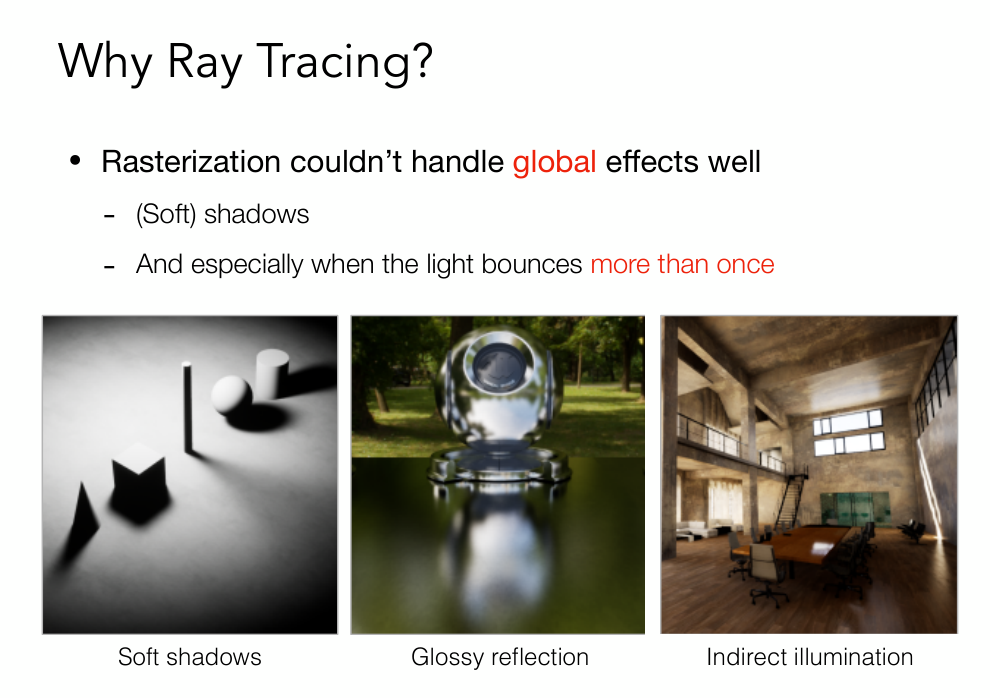
光栅化不能很好的解决一些全局的问题。  
1. 软阴影  
2. glossy反射（光线打到物体表面反射一次，再反射到人眼）  
3. 间接光照（漫反射）（光线到达人眼之前不止弹射一次）  
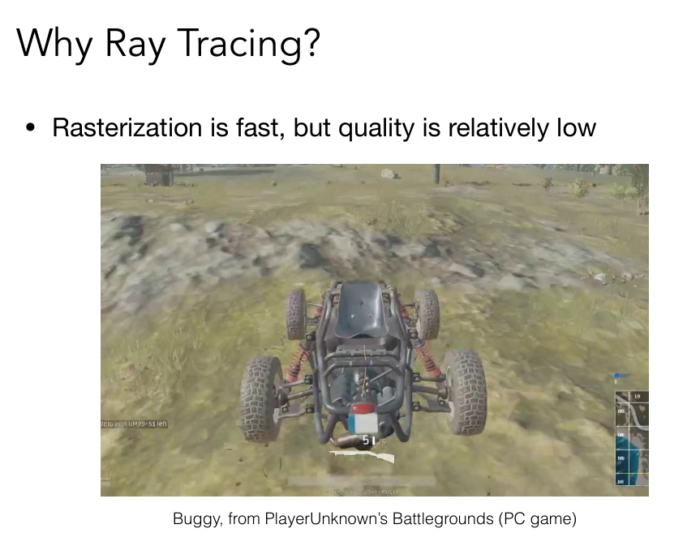
4. 质量很差
5. 
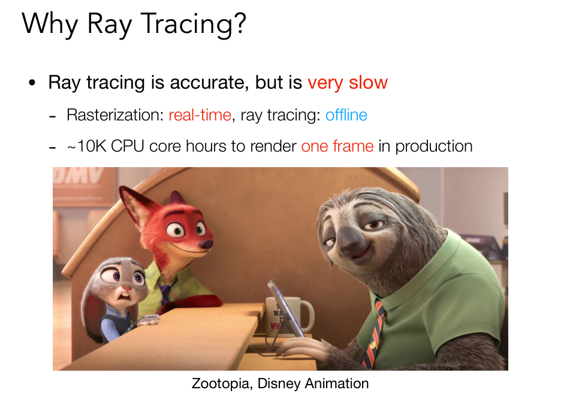
光线追踪：很费，效果很好，物理准确。
##### 开始前明确的
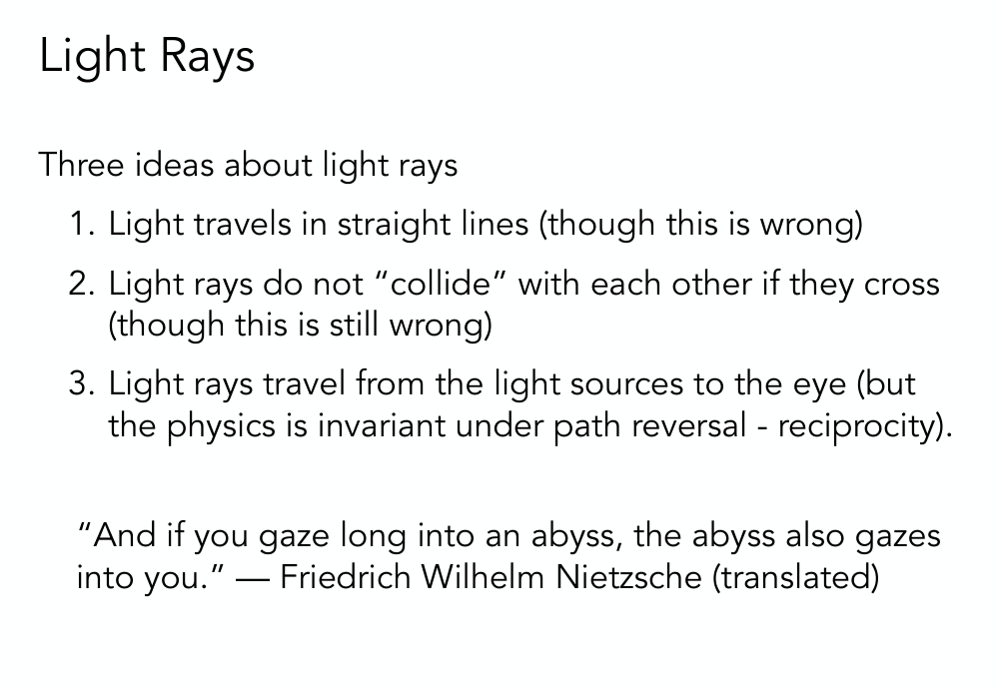
首先定义光线是什么？  

1. 光线是直线传播
2. 光线和光线直接不会发生碰撞
3. 光线的可逆性（眼睛发出光线找到光源）

当你凝视深渊，深渊也在凝视你。
##### Whitted-Style Ray Tracing
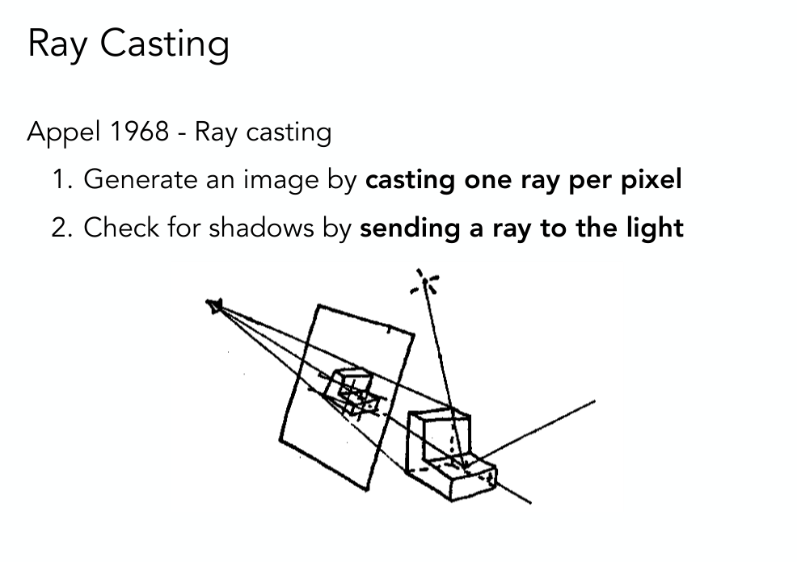
光线追踪，从终点相机发出射线，穿过成像平面的每一个像素，然后打出去和场景中的某一位置相交。
然后把这个位置和光源做一个连线，判断对光源是否可见，如果可见就形成了完整的光路。自然就可以计算出颜色。

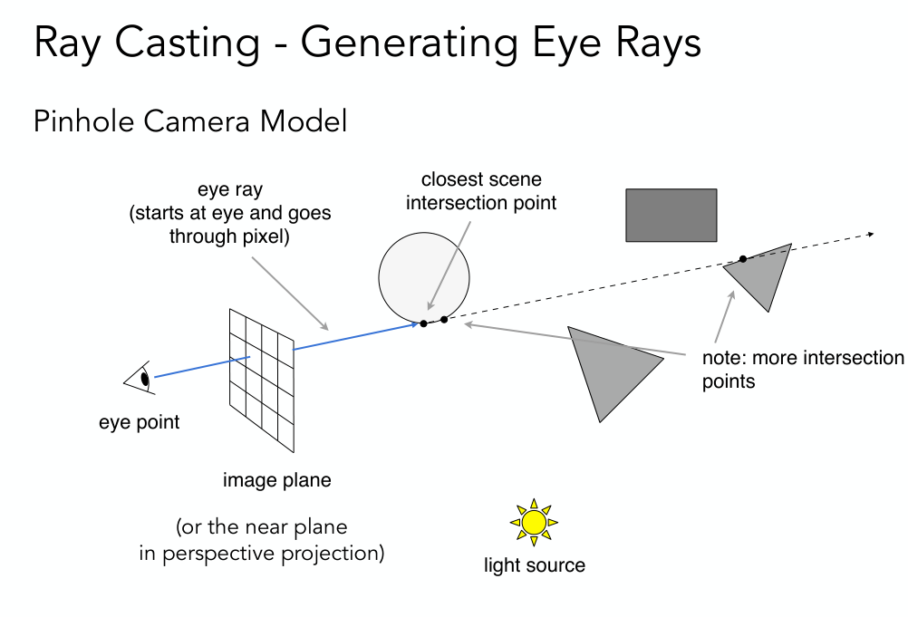
1. 从眼睛开始发出一根光线穿过某一个像素点，打到物体上，（eye ray）
2. 这个最近的交点自然而然会挡住其他点。
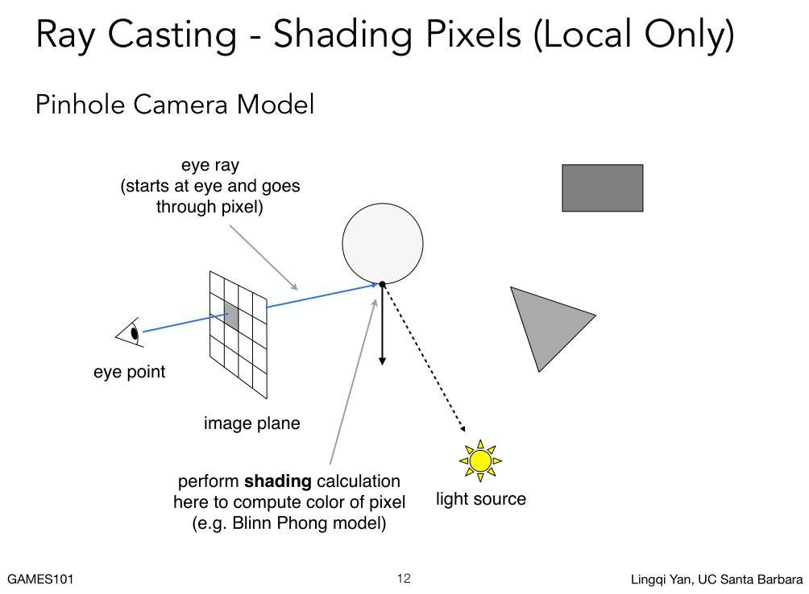
3. 黑色是这个点的法线，从这个点到光源连一条线，（shadow ray）  
4. 用各种各样的着色模型做着色。  

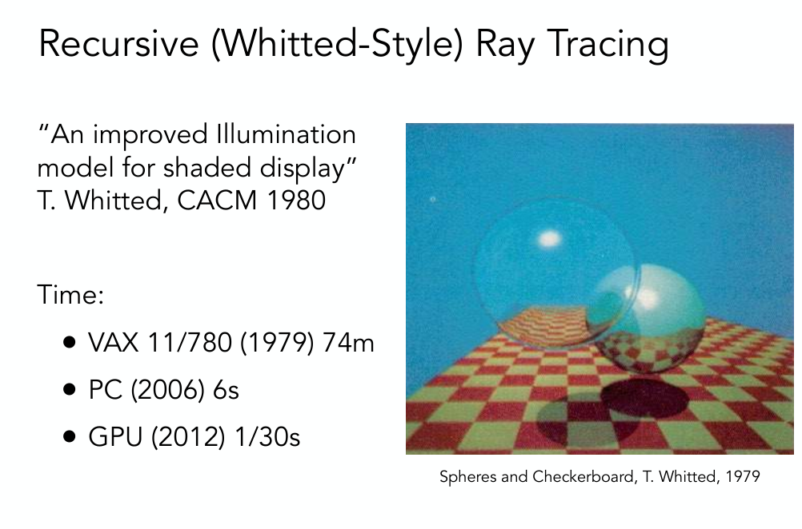
如何多次弹射光线呢？  
引入递归的Whitted 算法
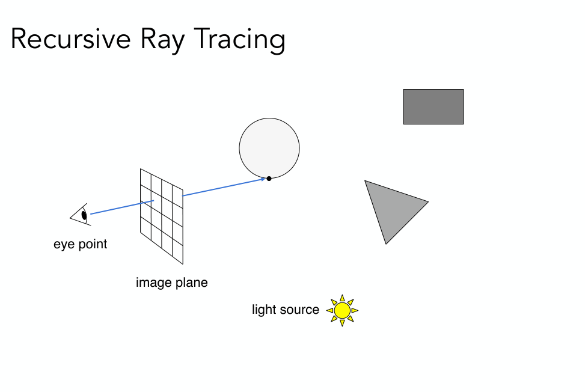
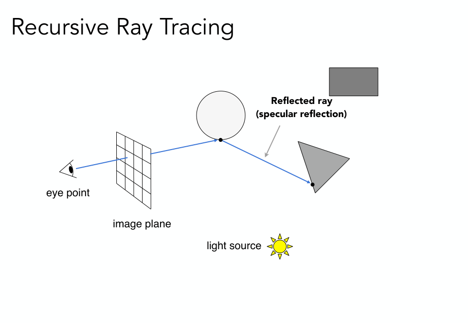
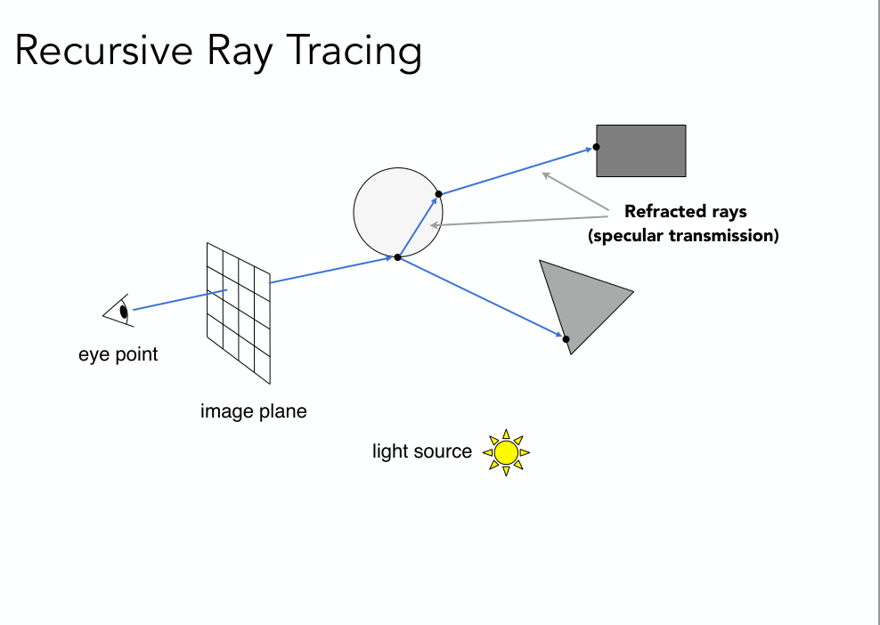
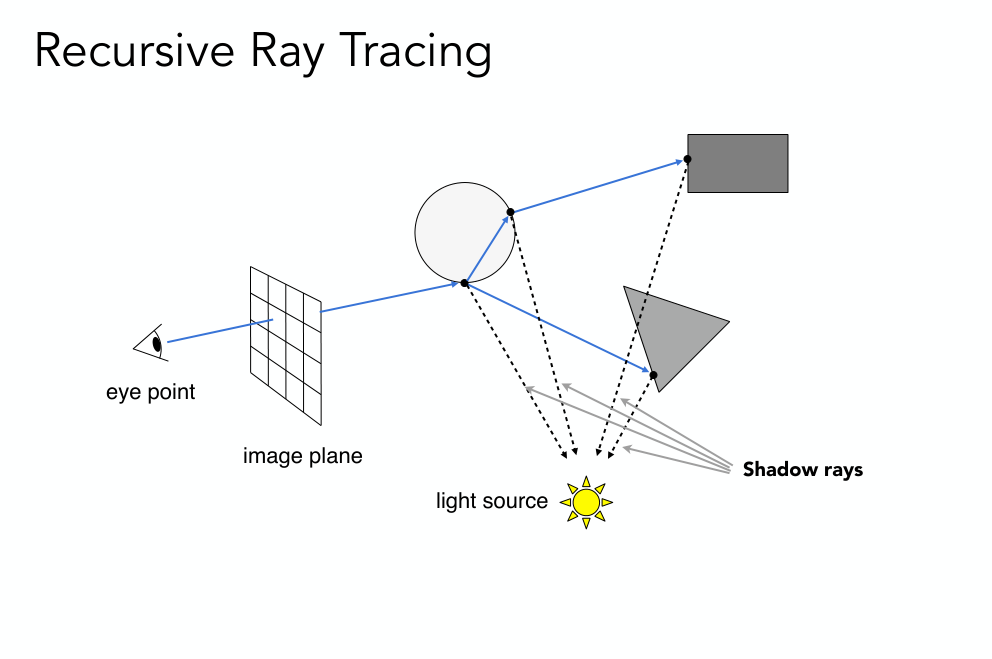
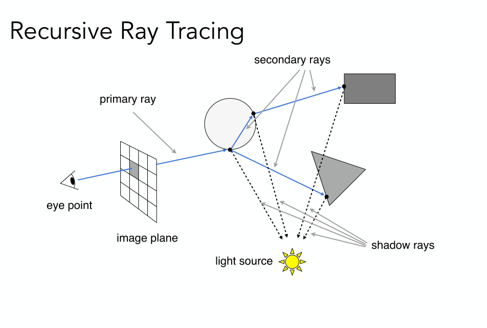
在任意的一个点继续传播，算出来多点继续跟光源连线算出着色值然后加回初始像素点（考虑能量守恒）。

##### 解决Whitted-Style Ray Tracing的技术问题

###### 怎么求光线和物体表面的交点?
1. 先定义光线
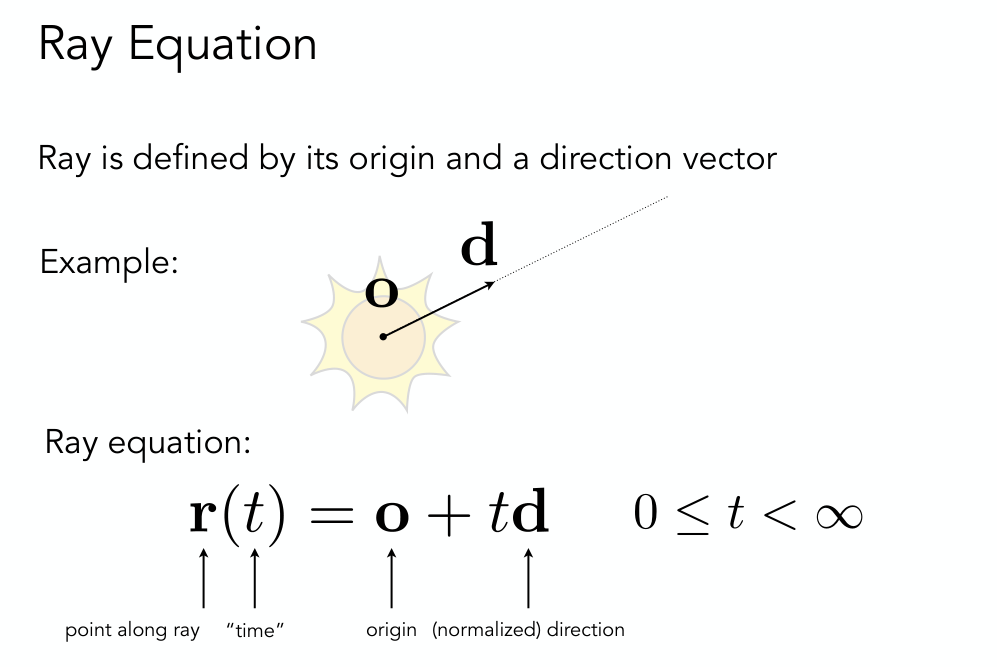
2. 
