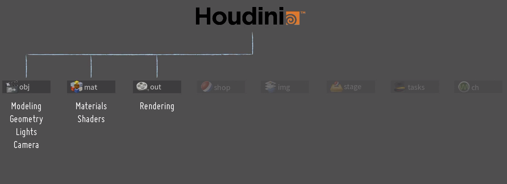
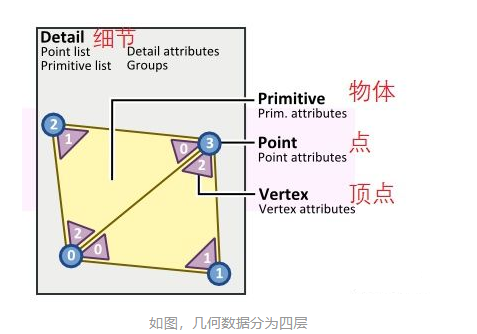
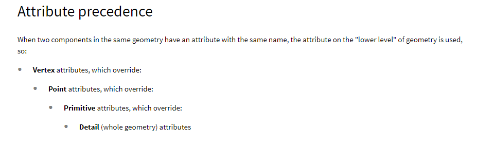
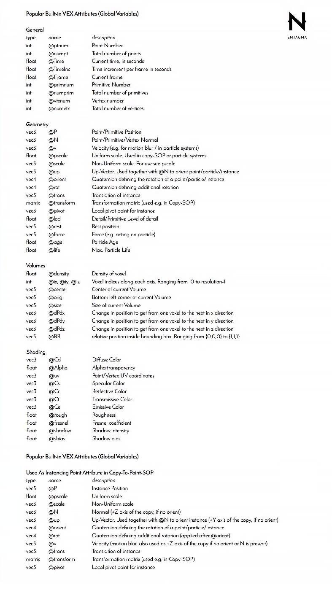
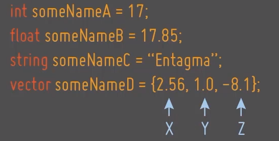
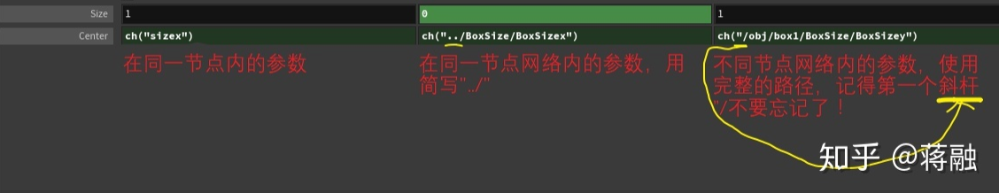
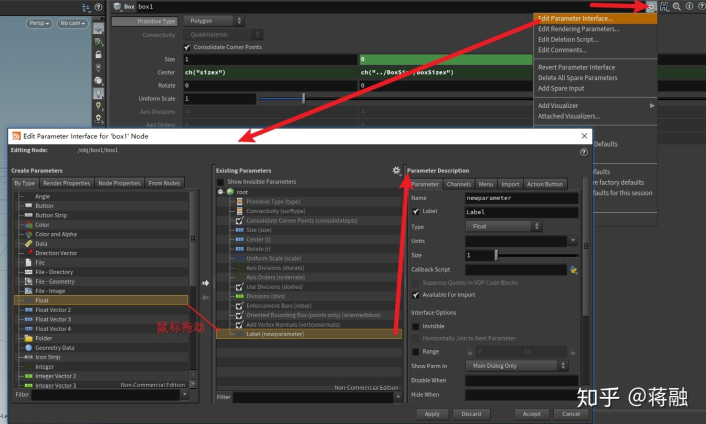
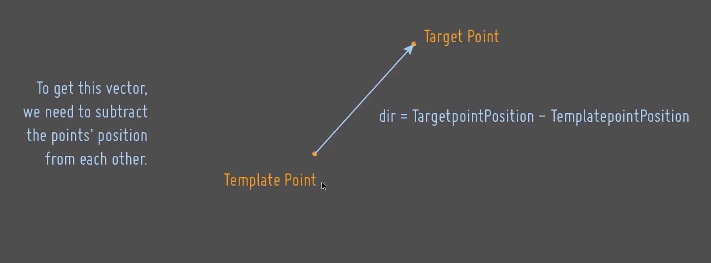
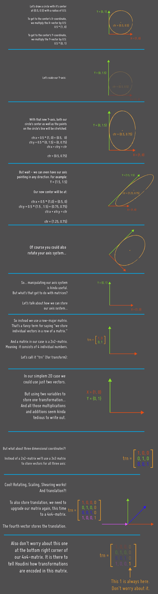

## 软件结构
我们可以看到，houdini是一个将各种独立的语境（context）融合在一起的操作系统。

<!-- more -->
## 几何对象

### 层次

1. Detail 最高层级的数据，对应整个Object；
2. Primitive 几何对象中的组成部件，比如一个三角面片，一张NURBS曲面，或Volume；
3. Point 几何对象上面的一个点；
4. Vertex 一个Point可能同时存在于多个相邻的Primitive上，因此共享同一个Point的 多个primitive会各自存一份对Point的引用，称为Vertex。

### 属性优先级



## 变量类型

### 属性 Attribute
最重要的数据类型就数属性了
#### 读取/修改属性
* 使用已经定义的同层级属性的方式为：@变量名
    * v@Cd 颜色属性
    * @P 位置属性
    * @ptnum 点ID
    * @primnum 图元ID
* 不同层级之间的属性读取
    * point(...)
    * prim(...)
    * detail(...)


#### 增加属性
* 数据类型 @变量名
    * i@name（赋予整型）
    * i[]@name（赋予数组）
* 在定义一个新的属性时，等号右边（即我们赋予该属性的初始值）必须是常量，也就是说只能是具体的数值， 不能包含任何函数或运算。
    * 对：float@mass=1；
    * 错：float@mass =1/area;
    * 错：vector @up = set(0,1,1);


#### 删除属性
* 属性在整个节点网络中，一旦你创建了，在人为手动删除它之前，就是一直存在并且全局都可见的（就是任何时候，只有你想要就可以读取）。因此属性是非常消耗空间和性能的，应当尽可能节约使用，如果预计将来再也不需要这个属性时，就应当使用Attribute Delete删除掉。
* [Attribute Delete](https://link.zhihu.com/?target=https%3A//www.sidefx.com/docs/houdini/nodes/sop/attribdelete.html)

#### 常用属性
 


### 变量 Variable
* 一些VEX代码中的变量，如果它们只会在该节点的代码里面用到，那么就没有必要设置为属性了，我们称之为局部变量，就是它只属于所在的这个节点，节点算完之后就把它所占用的空间释放了，生不带来，死不带去。

  
* 数组创建 float array_name[] 
* 变量转向量 vector pos = set(x_var,y_var,z_var)

### 参数 Parameter
* 参数一般出现在节点的paramter窗口，我们可以通过参数这些对节点进行调整。
参数非常重要，所以这里详细讲它的几种使用方式：
    * 在窗口上，对参数进行自动链接；
      右键点击源参数，选择"Copy parameter"。
      右击你要粘贴到的那个参数，选择"Paste relative reference"。
    * 在窗口上，对参数进行手动链接；
      此处使用的并不是VEX，而是HScript表达式，但是由于太重要了，就也写在这里：
      在目标参数处输入函数ch("源参数路径")，源参数路径的格式有3种情况：
      
    * 在窗口上，手动创建参数；流程见下图，注意在"Parameter Description"一栏，我们新创建的变量有2个名称：Name和Label，Name是参数“真正”的名字，我们在使用ch("参数名")或者VEX内引用该参数时，都用的是Name，注意，Name不能包含空格；但是Label可以包含空格，作为参数在用户界面上显示的名称。
      
    * 在Wrangle节点里，用VEX代码读取窗口上的参数；同上，使用chi, chf, chv, chs即可。


## 常用函数

* printf 打印函数 
    ` printf("str"); `

* addpoint 添加点函数
    ```c
    int  addpoint(int geohandle, int point_number)
    int  addpoint(int geohandle, vector pos)
    ```

* addprim 添加图元函数 
    Adds a primitive to the geometry.

    `int  addprim(int geohandle, string type)`

    ```c
    int  addprim(int geohandle, string type, int pt0)

    int  addprim(int geohandle, string type, int pt0, int pt1)

    int  addprim(int geohandle, string type, int pt0, int pt1, int pt2)

    int  addprim(int geohandle, string type, int pt0, int pt1, int pt2, int pt3)
    ```

* addvertex 添加顶点函数 
    Adds a vertex to a primitive in a geometry.
    `int  addvertex(int geohandle, int prim_num, int point_num)`

* rand 随机函数 
    Creates a random number between 0 and 1 from a seed.
    ```
    float  rand(float seed)
    vector2  rand(float seed)
    vector  rand(float seed)
    vector4  rand(float seed)
    float  rand(float seed, float seed2)
    vector2  rand(float seed, float seed2)
    vector  rand(float seed, float seed2)
    vector4  rand(float seed, float seed2)
    float  rand(vector2 seed)
    vector2  rand(vector2 seed)
    vector  rand(vector2 seed)
    vector4  rand(vector2 seed)
    float  rand(vector seed)
    vector2  rand(vector seed)
    vector  rand(vector seed)
    vector4  rand(vector seed)
    float  rand(vector4 seed)
    vector2  rand(vector4 seed)
    vector  rand(vector4 seed)
    vector4  rand(vector4 seed)
    ```

* fit 重映射函数 
    Takes the value in one range and shifts it to the corresponding value in a new range.
    `float  fit(float value, float omin, float omax, float nmin, float nmax)`

* ch 滑块函数
    Evaluates a channel (or parameter) and return its value.
    `ch("string");`

* Chramp 样条映射控制面板/斜坡控制/梯度控制
    Evaluates a ramp parameter and return its value.
    `ch("string");`

* floor  地板函数
    Returns the largest integer less than or equal to the argument.
    返回小于或等于参数的最大整数。
    float|int floor(float n)

* ceil 天花板函数
    Returns the smallest integer greater than or equal to the argument.
    返回大于或等于参数的最小整数。
    float  ceil(float n)

* trunc 删除浮点数的小数部分
    如果参数为负，则返回ceil（x），否则返回floor（x）。
    `float  trunc(float x)`


* curlnoise 卷曲噪点函数 
    Computes divergence free noise based on Perlin noise.
    `vector  curlnoise(vector xyz);`
    `vector  curlnoise(vector4 xyzt)`

* push 数组添加元素函数 
    Adds an item to an array.
    `void  push(<type>&array[], <type>value)` 
    `void  push(<type>&array[], <type>values[])`

* pop 数组弹出函数 
    Removes the last element of an array and returns it. `<type> pop(<type>&array[])`
    `<type> pop(<type>&array[], int index)`

* removeindex 数组删除元素函数 
    Removes an item at the given index from an array.
    `<type> removeindex(<type>&array[], int index)`

* nearpoint 查找最近顶点函数 
    Finds the closest point in a geometry. 
    ```c
    int  nearpoint(<geometry>geometry, vector pt)

    int  nearpoint(<geometry>geometry, vector pt, float maxdist)

    int  nearpoint(<geometry>geometry, string ptgroup, vector pt)

    int  nearpoint(<geometry>geometry, string ptgroup, vector pt, float maxdist)
    ```

* nearpoints 查找最近顶点函数 
    Finds the closest point in a geometry. 

    ```c
    int [] nearpoints(<geometry>geometry, vector pt, float maxdist)
    
    int [] nearpoints(<geometry>geometry, vector pt, float maxdist, int maxpts)
    
    int [] nearpoints(<geometry>geometry, string ptgroup, vector pt, float maxdist)
    
    int [] nearpoints(<geometry>geometry, string ptgroup, vector pt, float maxdist, int maxpts)
    ```

* minpos 查找最近函数
    Finds the closest position on the surface of a geometry.
    vector  minpos(<geometry>geometry, vector point)

* point 从几何体上读取点的某个属性的值函数 
    Reads a point attribute value from a geometry. 
    `point(<geometry>geometry, string attribute_name, int pointnumber)`

* primpoints 从几何体上读取点函数
    Returns the list of points on a primitive.
    `int [] primpoints(<geometry>geometry, int primnum)`

* distance 距离函数 
    Returns the distance between two points. 
    `float  distance(vector2 a, vector2 b)`

* removepoint 删除点函数 
    Removes a point from the geometry. 
    `int  removepoint(int geohandle, int point_number)`

* primpoint 将图元/顶点转换为点的ID函数. 
    Converts a primitive/vertex pair into a point number. 
    `int primpoint(<geometry>, int primnum, int vertex)`

* itoa 整型转字符串函数 
    Converts an integer to a string. 
    `string  itoa(int number)`

* getbbox_max 计算几何的边界框的最小值函数 
    Returns the maximum of the bounding box for the geometry.. 
    `vector  getbbox_max(geometry)`

* getbbox_max 计算几何的边界框的最大值函数 
    Computes the minimum of the bounding box for the geometry. 
    `vector  getbbox_max(<geometry>geometry, string primgroup)`

* getbbox_size 返回边界框的尺寸函数
    Returns the size of the bounding box for the geometry.
    `vector  getbbox_size(<geometry>geometry)`
    `vector  getbbox_size(<geometry>geometry, string primgroup)`

* lerp 在值之间执行双线性插值函数
    ```c
    Performs bilinear interpolation between the values.
    float  lerp(float value1, float value2, float amount)
    Performs bilinear interpolation between corresponding components.
    <vector> lerp(<vector>value1, <vector>value2, float amount)
    ```

* removeprim 删除图元函数
    Removes a primitive from the geometry.
    `int  removeprim(int geohandle, int prim_number, int andpoints)`

* pow 冪函數 
    Raises the first argument to the power of the second argument.
    ```c
    float  pow(float n, float exponent)
    <vector> pow(<vector>v, float exponent)
    ```

* setpointattrib设置顶点属性函数
    Sets a point attribute in a geometry.
    ```c
    int  setpointattrib(int geohandle, string name, int point_num, <type>value, string mode="set")
    int  setpointattrib(int geohandle, string name, int point_num, <type>value[], string mode="set")
    ```


* npoints 得到几何体的点数函数
    Returns the number of points in the input or geometry file.
    `int  npoints(<geometry>geometry)`

* resize 设置数组长度函数
    Sets the length of an array.
    `void  resize(<type>&array[], int size)`

* argsort 数组排序函数
    Returns the indices of a sorted version of an array.
    `int [] argsort(<type>value[])`

* setpointgroup 添加点组函数
    Adds or removes a point to/from a group in a geometry.
    `int  setpointgroup(int geohandle, string name, int point_num, int value, string mode="set")`
    geohandle

    A handle to the geometry to write to. Currently the only valid value is 0 or geoself, which means the current geometry in a node. (This argument may be used in the future to allow writing to other geometries.)

    name

    The name of the group to modify.

    point_num

    The point number to add or remove from the group.

    value

    1 to put the point in the group, 0 to remove the point from the group. This is ignored if mode is "toggle".

    mode

    Use "set" to set the point’s membership according to the value. Use "toggle" to toggle the point’s membership, regardless of the value.

* pointprims 返回一个图元包含的点函数
    pointprims
    Returns the list of primitives containing a point.
    `int [] pointprims(<geometry>geometry, int ptnum)`


* intersect 计算射线与几何的交叉函数 
    This function computes the first intersection of a ray with geometry.


* detail 从几何读取详细信息属性值的函数

    Reads the value of a detail attribute value from a geometry.
    ```
    type> detail(<geometry>geometry, string attribute_name, int ignored=0)

    <type>[] detail(<geometry>geometry, string attribute_name, int ignored=0)
    ```

* radians 弧度函数
    Converts the argument from degrees into radians.
    从度数转弧度
    `float  radians(float num_in_degs)`

* rotate  旋转函数
    Applies a rotation to the given matrix.
    ```void  rotate(matrix2 &m, float amount)

    void  rotate(matrix3 &m, float amount, vector axis)

    void  rotate(matrix &m, float amount, vector axis)

    void  rotate(matrix3 &m, vector angles, int xyz)

    void  rotate(matrix &m, vector angles, int xyz)

    void  rotate(matrix3 &m, float angle, int axis)

    void  rotate(matrix &m, float angle, int axis)```
    ```


* scale 缩放函数
    Scales the given matrix in three directions simultaneously (X, Y, Z - given by the components of the scale_vector)
    ```
    void  scale(matrix2 &m, vector2 scale_vector)

    void  scale(matrix &m, vector scale_vector)

    void  scale(matrix3 &m, vector scale_vector)
    ```

* translate 位移函数
    Translates a matrix by a vector.
    ```
    void  translate(matrix &m, vector amount)

    void  translate(matrix &m, vector4 amount)
    ```

* quaternion  四元数函数
    Creates a vector4 representing a quaternion.
    创建一个表示四元数的vector4

    ```
    vector4  quaternion(matrix3 rotations)

    Creates a vector4 representing a quaternion from a 3×3 rotational matrix.

    vector4  quaternion(float angle, vector axis)

    Creates a vector4 representing a quaternion from an angle and axis. The angle is specified in radians.

    vector4  quaternion(vector angleaxis)

    Creates a vector4 representing a quaternion from a combined angle/axis. This is the normalized rotation axis multiplied by the rotation angle in radians.

    There used to be a fourth form that took a rotation vector. It has been renamed to eulertoquaternion and now takes radians.
    ```
* qrotate 四元数旋转函数

    Rotates a vector by a quaternion.
    通过四元数旋转向量。
    `vector  qrotate(vector4 quaternion, vector v)`

* slerp 四元数基于偏差的融和函数

    Quaternion blend between q1 and q2 based on the bias.
    `vector4  slerp(vector4 q1, vector4 q2, float bias)`

* primintrinsic  从几何读取基本图元函数

    Reads a primitive intrinsic from a geometry.
    从几何读取基本图元
    ```
    <type> primintrinsic(<geometry>geometry, string intrinsic_name, int prim_num)

    <type>[] primintrinsic(<geometry>geometry, string intrinsic_name, int prim_num)
    ```


## 常用表达式
* $FF 帧变量

## 节点

* scatter
撒点 散布节点

* isooffset
配合散布节点使用 可以散布到物体内部并且在位置上有一定随机

* attribute randomize
随机某个属性

* attribute paint
绘制变量属性,结合scatter可以实现局部撒点

* relax


## 快捷键
* 弹出代码框 ALT+E
* 弹出当前选中的功能区 ALT + SHIFT+ C
* 调整焦点 选中相机视口 回车（Show handle）+ Z

## vex语法

* for 循环

    ```c
    for(int i = 0 ; i>num;i++){
        something;
    }
    ```

* foreach循环

    ```c
    foreach(int npt;npts){
        something;
        }
    ```

* 条件判断
    ```
    if(){
        something;
    }
    else{
        something;
    }
    ```

    
    ```
    if(){
        something;
    }
    else if(){
        something;
    }
    else{
        something;
    }
    ```


## 外部函数导入和外部编辑器设置

* 外部编辑器设置
    1. 找到 C:\Users\username\Documents\houdini18.0 下找到** houdini.env **
    2. 加入这一行代码  注意路径和路径反斜线写法
    `Editor = "C:/Users/username/AppData/Local/Programs/Microsoft VS Code/Code.exe"`
    3. 然后重启houdini
* 外部函数导入
    1. 找到 C:\Users\username\Documents\houdini18.0 下找到** houdini.env **
    2. 加入这一行代码  注意路径反斜线写法和结尾字符
    `HOUDINI_VEX_PATH = "C:/Users/sunyuxiang/Documents/houdini18.0/Custom_VEX;&"`
    3. 然后把函数放到这里即可C:\Users\sunyuxiang\Documents\houdini18.0\Custom_VEX
    4. 然后重启houdini
    5. 调用方法 #include "你的函数文件夹名"
* 打开代码窗口
    1. Alt+E


## 每节例子总结


* 给顶点的法线信息指认随机生成的向量，通过滑块调整随机种子
    ```c
    float seed = chf("seed");

    // set random scale (0 ... 0.1)

    float pscale = rand(@ptnum+seed);//定义一个 浮点变量
    pscale *= .1; //浮点变量缩小十分之1
    f@pscale = pscale; //设置属性

    // set random orientation using N({-1,-1,-1} ... {1,1,1})
    vector randdir = rand(@ptnum+seed);

    //randdir = fit(randdir,{0,0,0},{1,1,1},{-1,-1,-1},{1,1,1});
    // 因为@ptnum是正轴递增，所以random的结果太相似 所以重新映射一下
    randdir = fit01(randdir,{-1,-1,-1},{1,1,1}); 

    //给顶点的法线信息指认随机生成的向量
    v@N = randdir;
    ```

* 所有点的向量实时指向某个点
    为了得到指向某个点的向量，我们需要用目标点减去基点如图：
    

    ```c

    //拿到接口1的 第0个顶点的属性名"P"的值
    vector tgtpos = point(1,"P",0);
    // 目标点减去 模板点 得到向量
    vector dir = tgtpos - v@P;
    //归一化向量
    //v@N =dir;
    v@N =normalize(dir);
    ```

* 使用卷积化随机函数创建向量赋予点

    ```c
    vector f = chv("Frequency");
    vector o = chv("offset");
    //这里是卷积化随机向量
    vector dir = curlnoise((v@P * f)+ o);
    //归一化向量
    v@N =normalize(dir);
    ```


* 使用nearpoints函数查找最近的点并创建线
    ```c

    float maxdist = chf("max_Dist");
    float mindist = chf("Min_Dist");

    //找到函数
    int npts[] = nearpoints(0,v@P,maxdist);

    //移除找到的自己
    removeindex(npts,0);

    //赋予属性给点
    i[]@npts = npts;

    foreach(int npt;npts){
        vector npos = point(0,"p",npt);
        float dist = distance(v@P,npos);
        if(dist > mindist){
            addprim(0,"polyline",@ptnum,npt);
        }
    }

    ```


## 理解矩阵很好的教程

 

