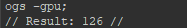
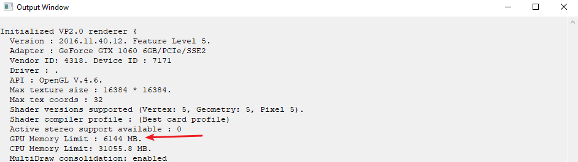
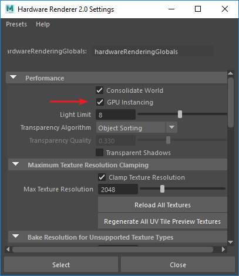
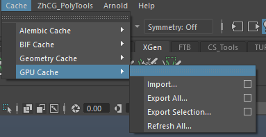

# 针对美术制作的 Maya 卡顿优化

## CPU

### 信息获取

- 解释分析器
- 求值工具包

## GPU

### 	信息获取

- Viewport 2.0,必须拥有正确的图形配置和图形驱动程序版本。有关 Maya 认证显卡和最新驱动程序版本的信息：

  https://knowledge.autodesk.com/certified-graphics-hardware

  

- GPU 内存

  对于包含大量纹理、几何体或缓存动画的场景，请务必记下显卡上可用的 GPU RAM 量，如果 GPU RAM 使用量非常接近显卡的 GPU RAM 限制，纹理可能无法加载，并且场景可能显示为着色模式。此时将显示一条错误信息，指明已超出纹理 RAM 限制并建议您减小“最大纹理分辨率”(Max Texture Resolution)钳制。

  查看 GPU 内存使用情况（以 MB 为单位），请使用Mel命令 

  <!-- more -->

  ```
  ogs -gpu
  ```

  如图：

  

- 查看卡的 GPU RAM 限制，请参见“Maya 的输出窗口”(Output Window of Maya)。

  

### 	如何优化

- 尽量关闭屏幕空间环境光遮挡、多重采样抗锯齿、运动模糊。

- 不使用复杂的Shader（例如复杂的 ShaderFX 网络）或大量使用 DirectX 11 ubershader 的场景。

- 禁用灯光和灯光阴影。

- GPU 实例化可减少 GPU 内存使用量。

  

- 减小摄影机的远剪裁距离，以便在视口中显示较少的几何体

- 隐藏无需显示的对象

- 卸载引用文件

- 将对象更改为Bounding Box模式

- 关闭多个Maya，同时运行 Maya 和其他 3D 程序，需要额外的 GPU 内存。

- 可以考虑使用GPU缓存工作流程

  

  关于GPU缓存工作流程的更多内容：

  https://knowledge.autodesk.com/zh-hans/support/maya/learn-explore/caas/CloudHelp/cloudhelp/2018/CHS/Maya-ManagingScenes/files/GUID-C893BE60-6E65-4F36-8005-FD4D1A0E9822-htm.html

