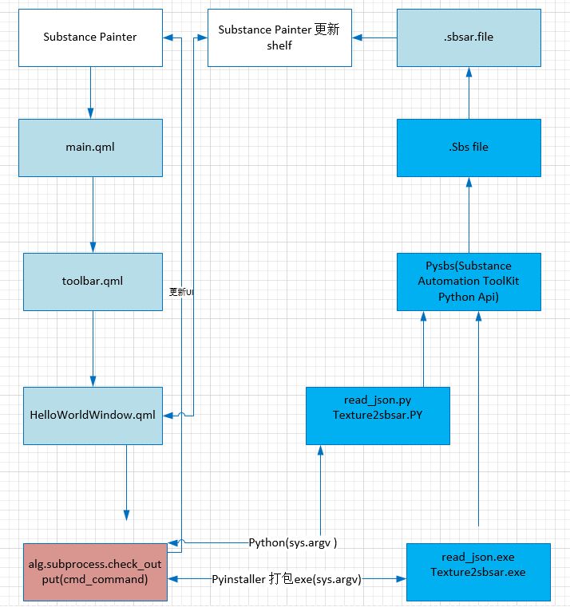
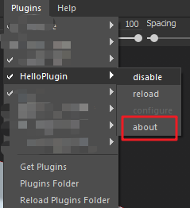
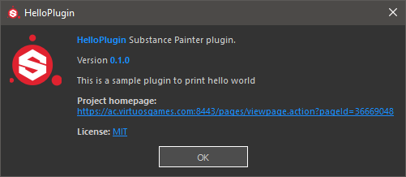
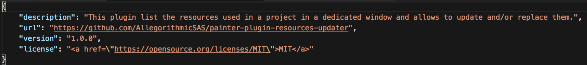
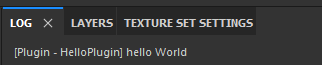

# Substance Painter Plugin 学习笔记

## First steps

核心思路：

<!-- more -->
### Plugin skeleton

```Js
import QtQuick 2.2
import Painter 1.0

PainterPlugin {
        // starts a timer that will trigger the 'onTick' callback at regular interval
        // 启动一个计时器，该计时器将定期触发“ on tick”回调
        tickIntervalMS: -1 // -1 禁用（默认值）

        // starts a JSON server on the given port:
        // 在给定的端口上启动json服务器
        // you send javascript that will be evaluated and you get the result in JSON format
        //您发送将被评估的javascript，并以json格式获取结果
        jsonServerPort: -1 // -1 禁用（默认值）

        Component.onCompleted: {
                // Called after the object has been instantiated.
                // 在实例化对象之后调用。
                // This can be used to execute script code at startup,
                // 可用于在启动时执行脚本代码，
                // once the full QML environment has been established.
                // 现已建立完整的qml环境
                alg.log.info("Component.onCompleted")
        }

        onTick: {
                // Do something at each tick, depending on tickIntervalMS value
                // 在每个滴答声中有一些东西，具体取决于滴答间隔ms值
                alg.log.info("onTick")
        }

        onConfigure: {
                // Do something when the user request the plugin configuration panel
                // 当用户请求插件配置面板时执行某些操作
                alg.log.info("onConfigure")
        }

        onApplicationStarted: {
                // Called when the application is started
                // 启动应用程序时调用
                alg.log.info("onApplicationStarted")
        }

        onNewProjectCreated: {
                // Called when a new project is created, before the onProjectOpened callback
                // 在创建新项目时调用，在on project打开回调之前调用
                alg.log.info("onNewProjectCreated")
        }

        onProjectOpened: {
                // Called when the project is fully loaded
                // 在项目完全加载时调用
                alg.log.info("onProjectOpened")
        }

        onProjectAboutToClose: {
                // Called before project unload
                // 在项目卸载之前调用
                alg.log.info("onProjectAboutToClose")
        }

        onProjectAboutToSave: function(destinationUrl) {
                // Called before a save, 'destination_url' parameter contains the save destination
                // 在保存之前调用，“目标网址”参数包含保存目标
                alg.log.info("onProjectAboutToSave: "+destinationUrl)
        }

        onProjectSaved: {
                // Called after the project was saved
                // 项目保存后调用
                alg.log.info("onProjectSaved")
        }

        onComputationStatusChanged: function(isComputing) {
                // Called when the state of the engine computing stacks content change.
                // 当引擎计算堆栈的状态更改内容时调用。
                // If the stack content is computed, 'isComputing' parameter will be false
                // 如果计算堆栈内容，则“正在计算”参数为false
                alg.log.info("onComputationStatusChanged: "+isComputing)
        }

        onExportAboutToStart: function(maps) {
                // Called just before the export process starts.
                // 在导出过程开始之前调用。
                // 'maps' is the list of filepaths expected to be written.
                // “映射”是预期要写入的文件路径的列表。
                alg.log.info("onExportAboutToStart: ")
                for (var stackName in maps) {
                    alg.log.info(stackName);
                    for (var filePath in maps[stackName]) {
                        alg.log.info(maps[stackName][filePath]);
                    }
                }

                // Example:
                // Open the 'PreviewSphere' sample, set 'C:/tmp' as export path, choose 'png' as export
                // 打开“预览球”示例，将“ c：/ tmp”设置为导出路径，选择“ png”作为导出
                // format and select the 'PBR MetalRough' config, the example above will output:
                // 格式化并选择“ pbr metal raw”配置，以上示例将输出：

                // onExportAboutToStart:
                // Sphere
                // c:/tmp/Sphere_Sphere_BaseColor.png
                // c:/tmp/Sphere_Sphere_Roughness.png
                // c:/tmp/Sphere_Sphere_Metallic.png
                // c:/tmp/Sphere_Sphere_Normal.png
                // c:/tmp/Sphere_Sphere_Height.png

                // Please note the 'Opacity' and 'Emissive' maps are not listed here because they
                // 请注意，此处未列出“不透明”和“发射”地图，因为它们
                // can not be exported with this sample while the actual export will warn about it.
                // 不能与该样品一起出口，但实际出口会发出警告。
        }

        onExportFinished: function(status, maps) {
                // Called right after the export process ends.
                // 在导出过程结束后立即调用
                // 'status' is the error status returned by the process. Available values are:
                // “状态”是进程返回的错误状态。,可用值为：
                // - Export.Status_Ok
                // - Export.Status_Warn
                // - Export.Status_Error
                // - Export.Status_Canceled
                // 'maps' is the list of filepaths effectively exported.
                // “映射”是有效导出的文件路径的列表。
                alg.log.info("onExportFinished: ")
                if (status != Export.Status_Ok) {
                    alg.log.error("Export failed.")
                }
                else {
                    for (var stackName in maps) {
                        alg.log.info(stackName);
                        for (var filePath in maps[stackName]) {
                            alg.log.info(maps[stackName][filePath]);
                        }
                    }
                }
        }

}
```

* Plugin meta data:
Information about the plugin can be provided by creating a plugin.json file in the plugin directory. Available properties are:
可以通过在plugin目录中创建一个plugin.json文件来提供有关该插件的信息。,可用属性为：
description: plugin description, displayed in the plugin about dialog.
url: project homepage, displayed in the plugin about dialog. Warning, the scheme is mandatory to create a clickable link.
version: plugin version.
license: plugin license.
min_api_version: required minimal scripting API version.
Example:
```js
{
        "description": "This is a sample plugin",
        "url": "https://www.allegorithmic.com",
        "version": "0.1.0",
        "license": "<a href=\"https://opensource.org/licenses/MIT\">MIT</a>"
}
```

## Custom UI

```js
import QtQuick 2.2
import Painter 1.0

PainterPlugin {
        // 在实例化对象之后调用。
        // 可用于在启动时执行脚本代码，
        // 建立环境
        Component.onCompleted: {
                // 创建一个toolbar 按钮
                var t = alg.ui.addToolBarWidget("dock.qml");
                t.rectangle.color = "blue"
                t = alg.ui.addToolBarWidget("dock.qml");
                t.rectangle.color = "green"
                t = alg.ui.addToolBarWidget("dock.qml");
                t.rectangle.color = "yellow"
                t = alg.ui.addToolBarWidget("dock.qml");
                t.rectangle.color = "purple"
                // 创建停靠小部件
                alg.ui.addDockWidget("dock.qml");
        }

}
```

```js
import QtQuick 2.3
import QtQuick.Window 2.2
import QtQuick.Layouts 1.2

Item {
        width: 24
        height: 24
        objectName: "My plugin UI"
        property alias rectangle: rect

        Rectangle {
                id: rect
                anchors.fill: parent
                color: "red"
                MouseArea {
                        id: mouseArea
                        anchors.fill: parent
                        onClicked: {
                                var ok = alg.mapexport.showExportDialog();//打开导出窗口  alg是指Javascript API
                                if (ok) {
                                        alg.log.info("Export successful!")
                                } else {
                                        alg.log.warn("Export cancelled!")
                                }
                        }
                }
        }
}
```

## Javascript API
Namespace: alg

### alg.Members
<static> documents_directory 当前substance 文件所在文件夹路径
Properties:
Name                Type    Description
documents_directory string  Path to Substance Painter documents folder


<static> plugin_root_directory 当前插件所在文件夹路径
Properties:
Name                    Type    Description
plugin_root_directory   string  Root directory of the plugin

<static> version
Properties:
Name            Type    Description 
version.api     string  JavaScript api version 当前javascript api 版本
version.painter string  Substance Painter version 当前substance painter 版本

### alg. baking 
管理已打开项目的烘培

<static> bake(textureSetName)
烘焙具有当前烘焙参数的纹理集的贴图
Parameters:
Name            Type    Description
textureSetName  string  The texture set name

Throws:
alg.baking.BakingError

<static> commonBakingParameters()
从当前的项目里获得通用烘培设置
Throws:
alg.baking.BakingError
Returns:
The baking parameters as a JSON object
Type
object
Example
```js
// Form of the common baking parameters
     {
        commonParameters: {
          Apply_Diffusion: true,
          Dilation_width: 1,
          Output_Size: [9, 9]
        },
        detailParameters: {
          Antialiasing: "None",
          Average_Normals: true,
          Cage_File: "",
          High_Definition_Meshes: [],
          High_poly_mesh_suffix: "_high",
          Ignore_Backface: true,
          Low_poly_mesh_suffix: "_low",
          Match: "Always",
          Max_Frontal_Distance: 0.01,
          Max_Rear_Distance: 0.01,
          Relative_to_Bounding_Box: true,
          Use_Cage: false
        }
      }
```

待续

### alg.display
管理项目的显示设置

<static> getColorLutResource()
获得当前项目的色彩配置LUT的URL

<static> getEnvironmentResource()
获得当前项目的environment map的URL

<static> setColorLutResource(newUrl)
设置当前项目的颜色配置文件lut的URL

<static> setEnvironmentResource(newUrl)
设置当前项目的环境图的URL

### alg.ui
Ui 实用程序

<static> addDockWidget(qmlFileUrl)
从qml文件创建小部件，然后将其作为“停靠小部件”添加到主窗口
Name        Type    Description
qmlFileUrl  string  qml file to be loaded. Can be an absolute url or a path relative to the plugin directory.


<static> addToolBarWidget(qmlFileUrl)
从qml文件创建小部件，然后将其作为“工具栏”添加到主窗口。
Name        Type    Description
qmlFileUrl  string  qml file to be loaded. Can be an absolute url or a path relative to the plugin directory.

<static> addWidgetToPluginToolBar(qmlFileUrl)
从qml文件创建小部件，然后将其添加到插件工具栏。
Name        Type    Description
qmlFileUrl  string  qml file to be loaded. Can be an absolute url or a path relative to the plugin directory.

<static> clickButton(name)
Simulate a click on a button.

Name    Type    Description
name    string  the object name of the button


### alg. subprocess

Spawn new processes. All processes are started from the plugin root directory.
产生新进程。,所有进程均从插件的根目录启动。

<static> call(command)
Run command. Wait for command to complete, then return the returncode.
运行命令,等待命令完成，然后返回返回码

Name	Type	Description
command	string | Array.<string>	The command to be launched

<static> check_call(command)
Run command. Wait for command to complete. If the return code was zero then return, otherwise raise an error.
运行命令,等待命令完成。,如果返回码为零，则返回，否则返回错误。

Name	Type	Description
command	string | Array.<string>	The command to be launched

<static> check_output(command)
Run command. Wait for command to complete and return its standard output as a string. Raise an error if the return code is non-zero.
运行命令。,等待命令完成并以字符串形式返回其标准输出。,如果返回码不为零，则会引发错误

Name	Type	Description
command	string | Array.<string>	The command to be launched


<static> start(command [, callback])
Start the given command asynchronously.
异步启动给定命令。
command	string | Array.<string>		The command to be launched
callback	alg.subprocess~processEndedCallback	<optional>
Callback called when the command terminates


## 例子1

substance painter  hello world 窗口

* 首先需要有一个定义主入口点的qml文件main. 
1. C:\Users\sunyuxiang\Documents\Allegorithmic\Substance Painter\plugins
2. 在此处创建一个名为“ HelloPlugin”的文件夹 
3. 在插件内，创建两个文件  
        * plugin.json 
        * main.qml 
4. 打开main.qml文件写入

```javascript
import QtQuick 2.2
import Painter 1.0

PainterPlugin 
{
        Component.onCompleted: 
        {
                alg.log.info("hello world!")//注意这里，alg.log.info()等于python里面的print()
        }
}
```
* 填写JSON文件：
1. JSON文件包含插件的元数据，在这里显示.


2. 我们知道json文件是键值对,观察一下现有插件的json文件,然后修改一后面的值改为.


```javascript
{
    "description": "This is a sample plugin to print hello world",
    "url": "https://test",
    "version": "0.1.0",
    "license": "<a href=\"https://opensource.org/licenses/MIT\">MIT</a>"
}
```

* 然后打开substance painter

1. 可以看到log文件已经打印出了hello world

2. plugins下的对应插件名字下面的about也可以正常工作
3. 现在 我们可以看到插件的加载，还可以看到plugin.json文件的关于窗口信息.

* 添加一个窗口
1. 在我们的HelloPlugin目录中创建一个HelloWorldWindow.qml.
2. 编辑文件，添加代码来定义一个简单的窗口。

```
import AlgWidgets 1.0 //窗口类导入

AlgWindow
{
    // 属性就像对象类型上的变量
    id: window//对应 main.qml的id 这个id很有用，因为它允许我们在插件的其他位置引用该对象，访问其可见性之类的属性。  
    title: "hello world window"
    visible: true
}
```
* 现在，我们有一个简单的窗口，但是在看到窗口之前，我们需要在main.qml文件中实例化它。 
1. 编辑main.qml
```javascript
import QtQuick 2.2
import Painter 1.0

PainterPlugin 
{       
        HelloWorldWindow// 在这里声明一个window，HelloWorldWindow指向HelloWorldWindow.qml
        {
                id: window//对应 HelloWorldWindow.qml的id
        }

        Component.onCompleted: 
        {
                alg.log.info("hello world!")
        }
}
```
2. 现在打开substance painter 禁用插件在启用插件就会看到该窗口弹出，这是因为在加载插件时首先实例化该窗口（？），我们稍后将解决此问题。 

* 创建一个按钮：
1. 接下来创建一个按钮来替代禁用/启用
2. 打开“ HelloWorldWindow.qml”文件。
3. 我们将添加三件事： 
        * 一系列的布局元素。 
        * 一个标签。 
        * 一个按钮

```javascript
import AlgWidgets 1.0 

//下面这些模块是UI布局需要的
import QtQuick 2.7
import QtQuick.Layouts 1.3
import "."

AlgWindow
{
    id: window//对应 main.qml的id
    title: "hello world window"
    visible: true//注意这里

    ColumnLayout //也可以用 RowLayout这里定义了一系列的布局元素 
    {
        id: horizontalLayout
        anchors.fill: parent

        Rectangle //这里定义了一系列的布局元素 
        {
            id: buttonBar
            anchors.left: parent.left
            anchors.right: parent.right

            ColumnLayout//也可以用 RowLayout这里定义了一系列的布局元素 
            {
                anchors.fill:parent

                AlgLabel//一个标签
                {
                    id: buttonLabel
                    font.pixelSize: 14
                    font.bold: true

                    text: "Press Me"
                }

                AlgButton//一个按钮
                {
                    text: "Say Hello!"
                    //Layout.preferredWidth: Style.widgets.buttonWidth

                    onClicked:
                    {
                        alg.log.info("hello World")
                    }
                }


                }
            }
        }
    }
}
```
        1. QML窗口是使用一系列嵌套的布局对象创建的-为了达到我们的目的，我们将使用列，矩形和行。 
        2. 我们需要添加其他导入语句来访问这些对象类型-QtQuick和QtQuick.Layouts。
        3. 该列表示总体布局-元素将按照添加顺序堆叠在此形状中。 
        4. 矩形允许我们使用子布局填充此列的分区。 
        5. 最后，行布局允许我们添加将按照添加顺序从左到右呈现的元素。 
        6. 在行布局中添加AlgLabel和AlgButton将两个新元素添加到我们的窗口中。 
        7. 最后，为按钮定义“ onClicked”事件将替换启动时登录main.qml的位置。 

* 重新加载脚本：
可以使用painter中的Plugins-> HelloPlugin-> Reload  菜单即时重新加载脚本。在后面debug和尝试过程中这个超级有用，避免了我们要重新开关软件。

* 将插件添加到工具栏：
1. 现在如果关闭插件窗口，则必须通过reload插件才能再次打开插件窗口。 
2. 让我们在工具栏上添加一个按钮，来替代每次reload调用窗口。
3. 工具栏中的按钮将非常简单，要做的就是在按下插件窗口时切换可见性。 
4. 首先，我们将通过改变visible值的true改为false,让插件窗口不会加载自动弹出。
5. 创建一个名为“ toolbar.qml ” 的新文件，并且与我们之前所做的类似,仅一排，带有一个按钮。 
比较重要的是-插件加载时，属性变量“ windowReference”将由我们的插件填充。 
由于windowReference在本地以null开头，因此我们稍后将对其的调用包装在try / catch块中。 
如果脚本中其他地方的内容使我们无法创建窗口，那么这将阻止崩溃，我们可以将信息打印到控制台。 
```
import QtQuick 2.7
import QtQuick.controls 2.0
import AlgWidgets 1.0

Row //现在是横向的如果需要侧边的话就是AlgToolBarButton
{
    property var windowReference : null

    Button
    {
        id: rect
        width: 30
        height: 30

        onClicked:
        {
            try 
            {
                windowReference.visible = true
            }
            catch(err) 
            {
                alg.log.exception(err)
            }
        }
    }
}

```

* 最后，在“ main.qml”文件中，我们将添加一个新的工具栏小部件，该小部件将把“ toolbar.qml”实例化为工具栏上的按钮。 
我们还使用其ID将HelloWorldWindow实例分配给工具栏按钮中的windowReference变量。 
```JavaScript
import QtQuick 2.2
import Painter 1.0

PainterPlugin 
{
        // 在这里声明一个window，HelloWorldWindow指向HelloWorldWindow.qml
        HelloWorldWindow
        {
                id: window//对应 HelloWorldWindow.qml的id
        }

        Component.onCompleted: 
        {
                var qmToolbar = alg.ui.addWidgetToPluginToolBar("toolbar.qml")
                qmToolbar.windowReference = window//这里调用了window

        }

}

```
* 这就是向Substance Painter添加基本插件的小例子.
* ref：http://peterhanshawart.blogspot.com/2017/11/making-hello-world-substance-painter.html

## 例子2
```
AlgWindow
{
    Item
    {
        Item 
        {
            Row
            {
                Alglabel {}
                AlgTextInput {}
            }
            Row
            {
                AlgComboBox {}
                AlgLabel {}
                AlgComboBox {}
            }
            Row
            {
                AlgCheckBox {}
            }
        }
        GridView
        {
            ListElement {}
        }
        Item 
        {
            Row 
            {
                Rectangle {}
                FileDialog {}
                AlgButton {}
                AlgButton {}
            }
        }
    }
}
```