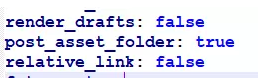
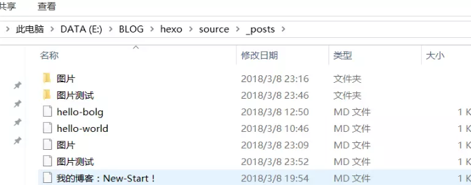

1. 首先确认主页配置的_config.yml中：post_asset_folder:true.
  

2. 在你的hexo目录下执行：
  `npm install hexo-asset-image --save`
  若出现错误则先执行：
  `npm install -g cnpm --registry=https://registry.npm.taobao.org`

  <!-- more -->

3. 等待一小段时间后，再运行hexo n "xxxx"来生成md博文时，/source/_posts文件夹内除了xxxx.md文件还有一个同名的文件夹。

4. 在xxxx.md中想引入图片时，先把图片复制到xxxx这个文件夹中。
  

5. 在xxxx.md中按照markdown的格式引入图片.

引用：
[系列4：总结别人hexo博客如何插图片方法（有自己实现的图片实例）](https://www.jianshu.com/p/a2786cdb06e1)

